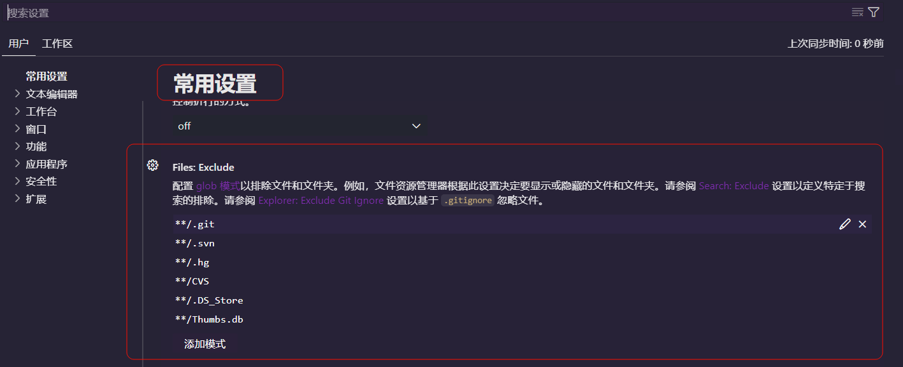

### Visual Studio Code 显示隐藏文件和目录（例如.git .svn等）

在默认的设置中，Visual Studio Code 对以下文件排除显示列表中：

```
"files.exclude": {
    "**/.git": true,
    "**/.svn": true,
    "**/.hg": true,
    "**/.DS_Store": true
}
```

你可以修改用户设置或者工作区设置，将.git文件添加到显示列表中

```"files.exclude":
"files.exclude": {
     "**/.git": false
}
```

如果在Visual Studio Code的设置页面中，可以使用下面的步骤修改设置：

文件》首选项》设置》常用设置》


