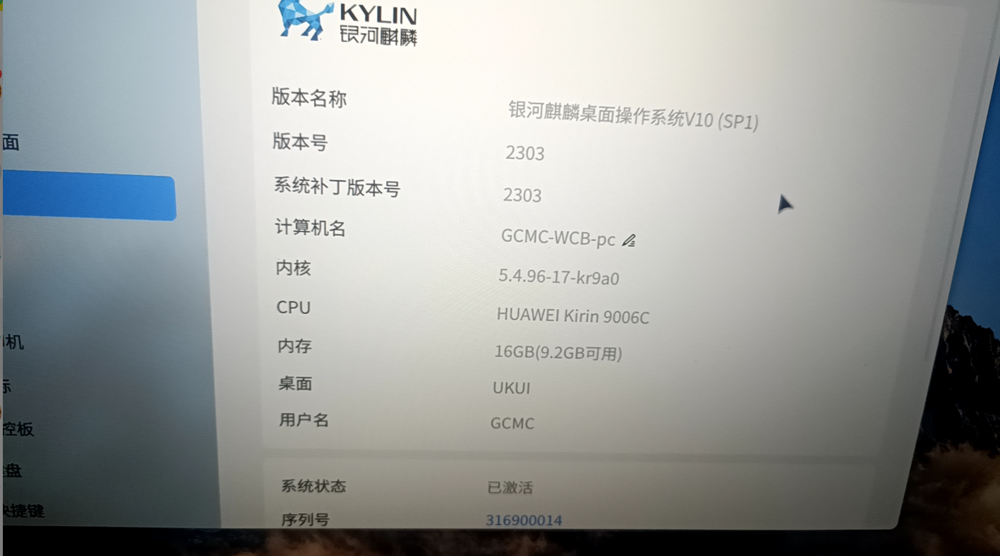
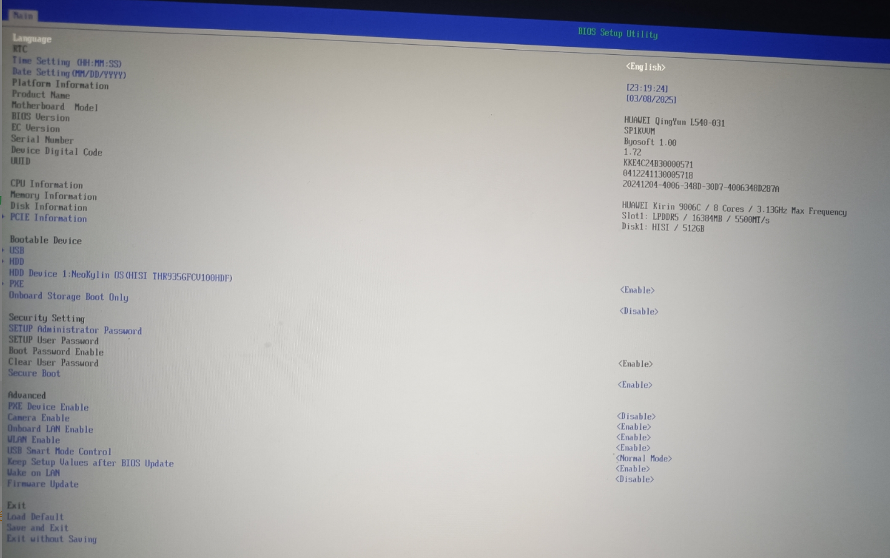
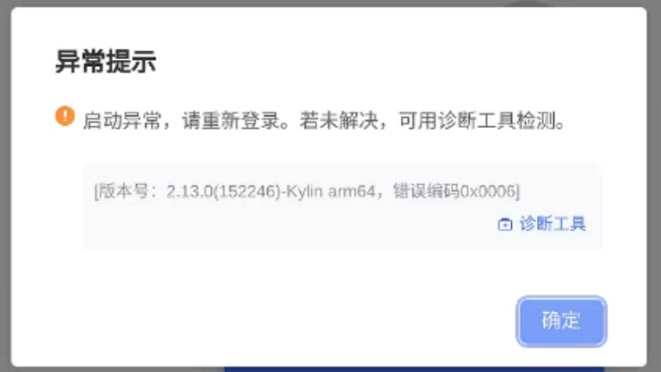

# 背景

使用不了Aone

[W515X，W585X，L420，L540装Windows最新进展_华为擎云l540能装windows吗-CSDN博客](https://blog.csdn.net/2403_88019847/article/details/143934149)

[L420\L540，笔记本适配windows成功_华为擎云l540能装windows吗-CSDN博客](https://blog.csdn.net/2403_88019847/article/details/144958171)

在bios界面找不到开启虚拟化的方式

解决方法使用：捷办公（如果地址失效了，我自己有备份一份，在我的百度云盘里面，全部文件》我的资源》捷办公+镜像）

百度网盘文件链接:https://pan.baidu.com/s/1IbyMXDnCILGjOty-GnUc2Q?pwd=6b8u 提取码:6b8u

