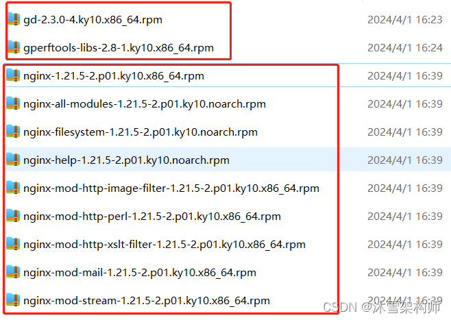

# 背景

在没有网络的环境下在银河麒麟v10系统下安装nginx
PS:银河麒麟v10的高级服务器版，最小化安装是没有make，gcc等基础编译工具的（wget也没有）

## 介绍

麒麟操作系统V10的不同版本，如V10 (Tercel)、V10 (Sword) 和 V10 (Lance)，主要是迭代更新和功能增强的体现。虽然详细的版本差异可能涉及多个技术细节和改进，但基于现有信息，我们可以概括如下：

- **V10 (Tercel)**：这是麒麟V10的第一个服务包（SP1），代号Tercel。通常，首个服务包会在原始版本基础上修复已知问题，优化性能，并可能引入一些新功能或安全更新。
- **V10 (Sword)**：作为第二个服务包（SP2），代号Sword，它在此前的基础上进一步加强了系统的稳定性、安全性及可能的性能优化。 Sword 版本可能包含了更多用户反馈后的改进和对最新硬件的支持。
- **V10 (Lance)**：第三个服务包（SP3），代号Lance，代表了麒麟V10的又一次重要更新。Lance版本预期会有更全面的安全补丁、额外的性能增强、以及对新出现的技术标准和应用场景的支持。它也可能会解决先前版本中的遗留问题，提供更加成熟和稳定的使用体验。
- 下载链接：[国产银河麒麟操作系统下载地址收集--【更新】2023.11.13_麒麟系统下载-CSDN博客](https://blog.csdn.net/duck251/article/details/128972878)

### 其他

- 中标麒麟neokylin基于centos（自带的自带的gcc版本为4.8或者5.4左右）。
- 银河麒麟kylin早期版本比如V2基于freebsd，新版本V4、V10基于ubuntu。
  - 银河麒麟，桌面版的基于ubantu（cpu架构相同的包基本通用，自带QT5.12）v10 SP1 gcc 是9.3
  - 服务器版本的银河麒麟基于centos（没错就是centos）gcc 7.3 据说不可升级，具体不得而知。
    - Kylin V10 SP1 对应的内核版本为 4.19.0-10
    - Kylin V10 SP2 对应的内核版本为 4.19.0-16
    - Kylin V10 SP3 对应的内核版本为 4.19.0-17

- 优麒麟ubuntukylin就是ubuntu的汉化版本，加了点农历控件啥的。
- deepin基于debian。
- uos基于deepin或者说是deepin的商业分支。
- ubuntu基于debian。

国产化的操作系统，不推荐使用webengine模块，至少低版本的不行，因为这个玩意会导致操作系统不定期蓝屏。高版本的可能会因为驱动等各种问题也会有坑


## 教程开始

一、查看[操作系统](https://so.csdn.net/so/search?q=操作系统&spm=1001.2101.3001.7020)版本号

```
[root@localhost ~]# nkvers
############## Kylin Linux Version #################
Release:
Kylin Linux Advanced Server release Host V10 (Kivity)

Kernel:
4.19.90-52.22.v2207.ky10.x86_64

Build:
Kylin Linux Advanced Server
release Host V10/(Kivity)-x86_64-Build17/20230423
#################################################

#Kivity这个应该是SP3的延续版本吧（网上找不到这个Kivity代号）
```

是V10 SP3版本，根据这个版本 去官网找对应的rpm包。

**银河麒麟操作系统的rpm包必须从官方找， 要是随便找个Centos的rpm包，可能会产生不兼容，甚至会把服务器搞挂掉。**

Index of /NS/V10/V10SP3/os/adv/lic/base/x86_64/Packages/  这个是sp3的所有基础包，

基本包里ng是1.16的有点老，我们要找1.21版本，则去updates目录下找找，地址如下：

https://update.cs2c.com.cn/NS/V10/V10SP3/os/adv/lic/updates/x86_64/Packages/
从2个地址下载11个包，如下图：



下载好后，上传到服务器。执行安装命令：

```bash
rpm -Uvh *.rpm --nodeps --force
```


# 结论（不可行，会出现缺少某某库）

待更新解决方案


具体库：例如：

2月 19 12:55:23 localhost.localdomain nginx[3964]: /usr/sbin/nginx: error while loading shared libraries: libprofiler.so.0: cannot open shared object file: No such file or directory

库名：gperftools

2月 19 14:14:58 localhost.localdomain nginx[4450]: /usr/sbin/nginx: error while loading shared libraries: libunwind.so.8: cannot open shared object file: No such file or directory

库名： libunwind-devel

ginx: [emerg] dlopen() "/usr/lib64/nginx/modules/ngx_http_image_filter_module.so" failed (libjpeg.so.62: cannot open shared object file: No such file or directory) in /usr/share/nginx/modules/mod-http-image-filter.co>
库名：libjpeg-turbo
nginx: [emerg] dlopen() "/usr/lib64/nginx/modules/ngx_http_image_filter_module.so" failed (libXpm.so.4: cannot open shared object file: No such file or directory) in /usr/share/nginx/modules/mod-http-image-filter.conf>
库名：libXpm-devel

等等等等

# 参考

[麒麟的版本 V10 (Lance) V10 (Tercel) 有什么区别-阿里云开发者社区](https://developer.aliyun.com/article/1548247)

[银河麒麟操作系统Kylin Linux 离线安装Nginx1.21.5_麒麟离线安装nginx-CSDN博客](https://blog.csdn.net/puzi0315/article/details/137238927)

[国产操作系统概览-CSDN博客](https://blog.csdn.net/wqc159/article/details/127146018)