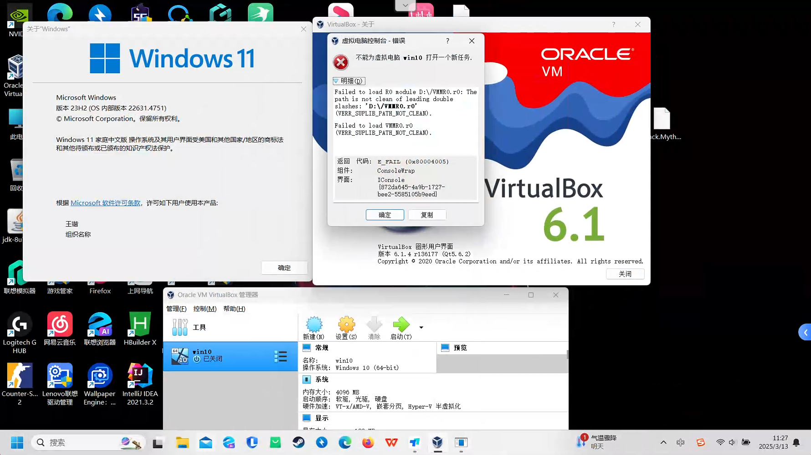

不能为虚拟电脑 win10 打开一个新任务.

Failed to load R0 module D:\/VMMR0.r0: The path is not clean of leading double slashes: 'D:\/VMMR0.r0' (VERR_SUPLIB_PATH_NOT_CLEAN).

Failed to load VMMR0.r0 (VERR_SUPLIB_PATH_NOT_CLEAN).

返回 代码: E_FAIL (0x80004005)

组件: ConsoleWrap

界面: IConsole {872da645-4a9b-1727-bee2-5585105b9eed}

解决方案：

[window10：虚拟机：不能为虚拟电脑 xxx 打开一个新任务. Failed to load VMMR0.r0 (VERR_SUPLIB_PATH_NOT_CLEAN)._powering vm upv name: vm 1failed to load ro module-CSDN博客](https://blog.csdn.net/weixin_44644254/article/details/103567304)