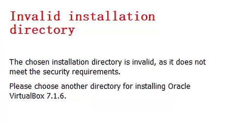

# 背景

在安装virtualbox，安装路径选择除C盘以为后，报错

待更新

D:\System Volume Information\*: 拒绝访问。

我的方法是安装一个virtualbox7.0.0的版本，然后在安装新版本（virtualbox7.1.6）覆盖

# 参考地址

[virtualbox7.0.16版本安装出现invalid installation directory-CSDN博客](https://blog.csdn.net/weixin_44628096/article/details/138014759)

[解决安装VirtualBox高版本不能自定义安装D盘问题 Invalid installation directory_让世界更美好的技术博客_51CTO博客](https://blog.51cto.com/u_15912723/11329806)

[科学网—Virtualbox7.0以上版本安装报错：Invalid installation directory - 郭令举的博文](https://blog.sciencenet.cn/blog-478347-1455267.html)

[超详细VirtualBox7安装教程，安装在D盘步骤，以及报错：Invalid installation directory解决办法-CSDN博客](https://blog.csdn.net/qiujicai/article/details/139854495)