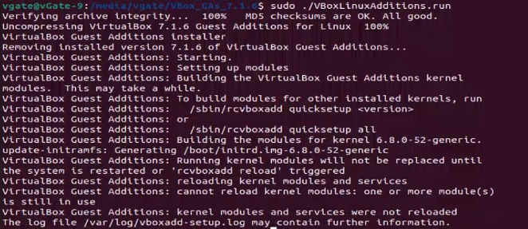
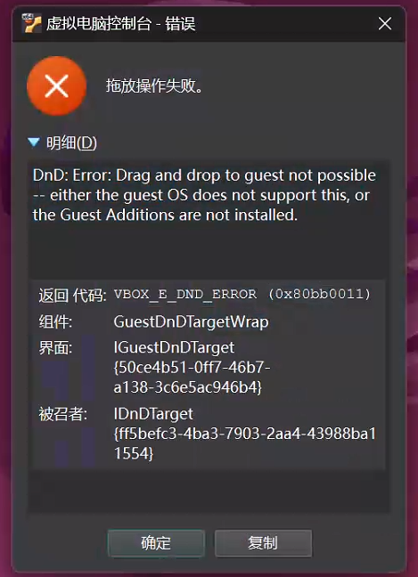

# 背景

如果你想使用virtualbox的主机与虚拟机复制粘贴、文件拖拽、共享文件、显示缩放等，都是需要安装virtualbox扩展功能(高级功能)


## 通过apt在线安装（适用于版本7.0.14，其他版本未知）

要实现从Windows上复制然后在VM VirtualBox上粘贴，必须要在VM VirtualBox上下载**virtualbox-guest-dkms**

按Ctrl+ALT+T打开命令终端输入

```
sudo apt-get install virtualbox-guest-dkms
```

PS：记得在状态栏》设备》共享粘贴板/拖放/开启状态哦

## 另外一个（待测试）

	sudo apt-get update
	sudo apt-get dist-upgrade
	sudo apt-get install virtualbox-guest-x11


# 通过下载Guest Additions CD映像 编译安装

**下载 VirtualBox（来宾添加）**：https://download.virtualbox.org/virtualbox

在网页中选择您的 [VirtualBox](https://cn.linux-console.net/?cat=virtualbox) 版本，然后选择下载“VBoxGuestAdditions_x.x.xxx.iso”文件。


#### 2.插入CD镜像

<iframe id="aswift_4" name="aswift_4" browsingtopics="true" width="920" height="0" frameborder="0" marginwidth="0" marginheight="0" vspace="0" hspace="0" allowtransparency="true" scrolling="no" allow="attribution-reporting; run-ad-auction" src="https://googleads.g.doubleclick.net/pagead/ads?client=ca-pub-6366716774018597&amp;output=html&amp;h=280&amp;slotname=2823961153&amp;adk=2794729367&amp;adf=3054512464&amp;pi=t.ma~as.2823961153&amp;w=920&amp;abgtt=6&amp;fwrn=4&amp;fwrnh=100&amp;lmt=1733026196&amp;rafmt=1&amp;format=920x280&amp;url=https%3A%2F%2Fcn.linux-terminal.com%2F%3Fp%3D8162&amp;fwr=0&amp;fwrattr=true&amp;rpe=1&amp;resp_fmts=3&amp;wgl=1&amp;uach=WyJXaW5kb3dzIiwiMTkuMC4wIiwieDg2IiwiIiwiMTMxLjAuMjkwMy43MCIsbnVsbCwwLG51bGwsIjY0IixbWyJNaWNyb3NvZnQgRWRnZSIsIjEzMS4wLjI5MDMuNzAiXSxbIkNocm9taXVtIiwiMTMxLjAuNjc3OC44NiJdLFsiTm90X0EgQnJhbmQiLCIyNC4wLjAuMCJdXSwwXQ..&amp;dt=1733026195708&amp;bpp=1&amp;bdt=1617&amp;idt=906&amp;shv=r20241120&amp;mjsv=m202411180101&amp;ptt=9&amp;saldr=aa&amp;abxe=1&amp;cookie=ID%3D77bd4e304a950dea%3AT%3D1725801681%3ART%3D1730011420%3AS%3DALNI_MZZZkmzuJ5_nAk-zRnD0t3NZQELGA&amp;gpic=UID%3D00000ef452aab42c%3AT%3D1725801681%3ART%3D1730011420%3AS%3DALNI_MaV85l6ia8PLj4Q-huh63J9VxcKTw&amp;eo_id_str=ID%3Da7188557adc71cd2%3AT%3D1725801681%3ART%3D1730011420%3AS%3DAA-AfjbEWHmBGtlhT5omS40aAwa1&amp;prev_fmts=0x0%2C920x280%2C920x280%2C920x200&amp;nras=1&amp;correlator=4698298897876&amp;frm=20&amp;pv=1&amp;u_tz=480&amp;u_his=1&amp;u_h=1152&amp;u_w=2048&amp;u_ah=1104&amp;u_aw=2048&amp;u_cd=24&amp;u_sd=1.25&amp;dmc=8&amp;adx=529&amp;ady=4645&amp;biw=1978&amp;bih=1026&amp;scr_x=0&amp;scr_y=834&amp;eid=31088128%2C31088580%2C31088727%2C31088957%2C95330279%2C31089116%2C31088457%2C95345967%2C95347433%2C95340253%2C95340255&amp;oid=2&amp;pvsid=3478643328730974&amp;tmod=1416724266&amp;wsm=1&amp;uas=0&amp;nvt=1&amp;ref=https%3A%2F%2Fcn.bing.com%2F&amp;fc=1920&amp;brdim=0%2C0%2C0%2C0%2C2048%2C0%2C2048%2C1104%2C1994%2C1026&amp;vis=1&amp;rsz=%7C%7CpeEbr%7C&amp;abl=CS&amp;pfx=0&amp;fu=128&amp;bc=31&amp;bz=1.03&amp;td=1&amp;tdf=2&amp;psd=W251bGwsbnVsbCxudWxsLDNd&amp;nt=1&amp;ifi=5&amp;uci=a!5&amp;btvi=2&amp;fsb=1&amp;dtd=908" data-google-container-id="a!5" tabindex="0" title="Advertisement" aria-label="Advertisement" fr-iframe-73bfb9ba="childList" data-google-query-id="CL6s_9fZhYoDFY9fDwIdKlgHmQ" data-load-complete="true" style="box-sizing: border-box; font-family: var(--fr-font-family),var(--fr-font-basefont); -webkit-text-stroke: var(--fr-font-stroke); font-feature-settings: var(--fr-font-feature,unset); font-variant: var(--fr-font-variant,unset); font-optical-sizing: auto; font-kerning: auto; text-rendering: optimizelegibility; left: 0px; top: 0px; border: 0px; width: 920px; height: 0px;"></iframe>

如果您在*主机操作系统*中下载了 CD 映像，请关闭虚拟机并打开其**设置**页面。

接下来，导航到“**存储**”选项卡。点击`控制器：IDE`后面的“添加光驱”图标，最后选择添加下载的访客附加光盘映像。最后，启动来宾操作系统。


如果您在来宾操作系统中下载了映像，则只需右键单击 *Downloads* 文件夹中的 .iso 映像，然后单击`使用磁盘映像安装程序打开`选项。


### 第 2 步：安装来宾添加项

如果步骤 1 正确完成，您将看到“`VBox_GAs_x.x.xx`”安装在文件管理器的左侧窗格中。

只需单击它即可打开磁盘内容页面，右键单击空白区域，然后选择“**在终端中打开**”以打开以该文件夹作为工作目录的终端窗口。


最后在弹出的终端窗口中一一运行下面2条命令进行安装：

- 首先，通过命令安装一些依赖库：

  ```powershell
  sudo apt install bzip2 build-essential gcc make perl dkms linux-headers-$(uname -r)
  
  Ubuntu22.04.5（virtualbox7.1.6 r167084）
  ```

  接下来，运行目录中的安装程序以开始安装 Guest Additions：
  
  ```undefined
  sudo ./VBoxLinuxAdditions.run
  ```
  
  


如果您要为此虚拟机添加共享文件夹，则**您还需要将用户添加到 `vboxsf` 组。**为此，请在来宾操作系统终端中运行以下命令窗户：

```powershell
sudo gpasswd --add $USER vboxsf
```


如果您想在来宾操作系统中访问 USB 设备，则需要将用户添加到主机操作系统中的 `vboxusers` 组中（需要注销并重新登录）。对于 Linux 主机，在终端中使用以下命令：

```powershell
sudo gpasswd --add $USER vboxusers
```

最后，重新启动来宾操作系统以应用更改。并且，打开`设置`对话框或`设备`菜单来根据需要配置“共享文件夹”，“共享剪贴板”等！


注意：其实拖拽文件实现复制粘贴，好像只能从宿主机中拖拽文件到虚拟机可以，但是从虚拟机拖拽不了文件到宿主机（原因未知）解决方法就是使用文件共享解决


# VirtualBox虚拟机拖放文件失败的问题（报错DnD: Error）

Ubuntu22.04.5（virtualbox7.1.6 r167084）可能会有如下报错：

文字复制粘贴，但是如果拖拽文件的话，就报错，具体图2





解决方法：经过检查，发现Ubuntu 22.04（注意22.04及以上版本默认使用的都是Wayland）的桌面使用了Wayland，导致这个问题，解决方法就是修改 `/etc/gdm3/custom.conf` ，取消注释 `WaylandEnable=false` → 重启主机切换为X11即可解决。


## 排查方法

1. **检查进程是否运行（Linux系统专用）**

   - 在虚拟机内执行 `ps aux | grep VBoxClient`，确认存在 `/usr/bin/VBoxClient --clipboard` 进程[1](https://blog.csdn.net/corner2030/article/details/80206505)。

   - 若进程未启动，手动执行：

     ```
     VBoxClient --clipboard
     ```

     或安装 `virtualbox-guest-x11` 包（Ubuntu/Debian）

     ```
     sudo apt install virtualbox-guest-x11
     ```

2.**排查解决窗口系统兼容性问题（Ubuntu主机专用）**

- 若主机为Ubuntu且使用Wayland窗口系统，可能(有概率)导致拖放失效。
- 修改 `/etc/gdm3/custom.conf` ，取消注释 `WaylandEnable=false` → 重启主机切换为X11

###  检查Ubuntu是否为Wayland

#### 一、命令行检测方法

1.查看会话类型变量

   ```
   echo $XDG_SESSION_TYPE 
   ```
   - 若输出 `wayland`，则当前为Wayland；

   - 若输出 `x11`，则为X11
2.检查Wayland专用变量
```
echo $WAYLAND_DISPLAY 
```
- 若返回类似 `wayland-0` 的路径，表示使用Wayland；
- 若无输出，则可能为X11
3.通过系统日志工具查询（使用 `loginctl` 命令查看当前会话属性）
```
loginctl show-session $(loginctl | grep $(whoami) | awk '{print $1}') -p Type 
```
- 输出 `Type=wayland` 或 `Type=x11` 直接标明当前窗口系统
####  二、图形界面检测方法
1. 登录界面检查
   - 在Ubuntu登录界面，点击用户名后方的齿轮图标（⚙️），查看选项：
     - 若包含 `Ubuntu on Xorg` 或 `Ubuntu (Wayland)`，当前选择的即为窗口系统类型[1](https://blog.csdn.net/sunyuhua_keyboard/article/details/145007430)[2](https://blog.csdn.net/hua_chi/article/details/139961070)。
2. 系统设置验证
   - 打开「设置」→「关于」→「窗口系统」：
     - 若显示 `Wayland` 或 `X11`，则为当前使用的窗口系统（部分Ubuntu版本可能不显示此信息）。


#### 三、修改命令

- 若主机为Ubuntu且使用Wayland窗口系统，可能(有概率)导致拖放失效。

- 修改 `/etc/gdm3/custom.conf` ，取消注释 `WaylandEnable=false` → 重启主机切换为X11

  ```
  #1使用 sed 取消注释 WaylandEnable=false
  
  sudo sed -i 's/^#WaylandEnable=false/WaylandEnable=false/' /etc/gdm3/custom.conf
  
  #2检查修改是否成功
  
  grep "WaylandEnable" /etc/gdm3/custom.conf
  
  #3重启主机以应用更改
  
  sudo reboot
  ```

  

# 参考

[解决Oracle VM VirtualBox无法与Windows互相复制粘贴的教程_virtualbox复制粘贴不了-CSDN博客](https://blog.csdn.net/m0_64148419/article/details/136900153)

[为 Ubuntu 24.04 VM 安装 VirtualBox Guest Additions](https://cn.linux-terminal.com/?p=8162)

[如何在 Ubuntu 中安装 VirtualBox 来宾添加](https://cn.linux-terminal.com/?p=7925)

[【virtualbox】【第二节】共享文件夹怎么设置，怎么用_virtualbox共享文件夹-CSDN博客](https://blog.csdn.net/weixin_44083579/article/details/137755051)

[VirtualBox下Ubuntu虚拟机共享文件夹、自动挂载相关配置_sudo mount -t vboxsf-CSDN博客](https://blog.csdn.net/shellching/article/details/128464615)