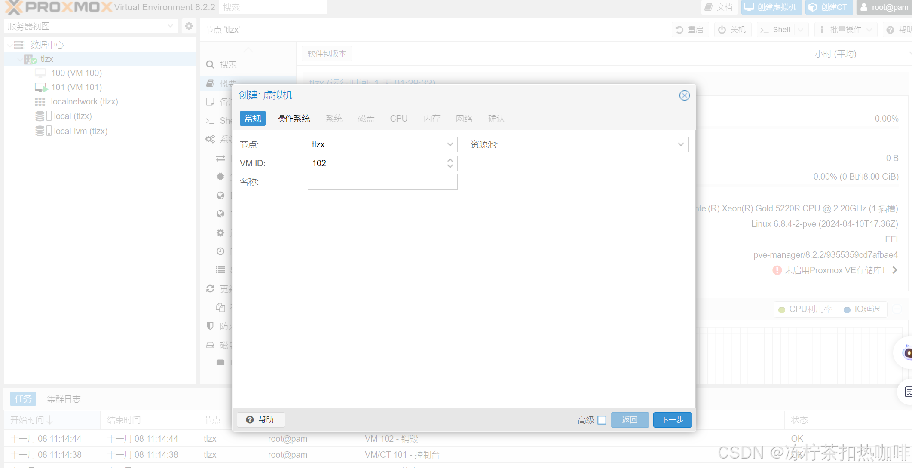

# 背景

PVE8.1.3（Virtual Environment 8.1.3） 显卡直通NVIDIA（GeForce GTX 1080 Ti）到Ubuntu24.04


## 步骤

1. 确认CPU和主板支持VT-d/IOMMU，并在BIOS中启用。 
2. 配置PVE内核参数以启用IOMMU和VFIO。 
3. 屏蔽宿主机上的Nvidia驱动，防止其占用显卡。 
4. 创建Ubuntu虚拟机时选择UEFI启动，并添加EFI磁盘。 
5.  将GTX 1080 Ti作为PCI设备直通到虚拟机。
6.  安装Ubuntu后禁用nouveau安装Nvidia官方驱动。

### 1确认CPU和主板支持VT-d/IOMMU，并在BIOS中启用

#### 1. **硬件兼容性**

- CPU/主板

  ：确认支持Intel VT-d或AMD IOMMU，并在BIOS中启用：

  - Intel平台：启用`VT-d`或`Intel Virtualization Technology for Directed I/O`。
  - AMD平台：启用`IOMMU`或`SVM Mode`。

- **显卡型号**：确认GTX 1080 Ti的PCI设备ID（通过`lspci -nn | grep NVIDIA`获取，如`10de:1b06`）。

### 2配置PVE内核参数以启用IOMMU和VFIO。

```
# 1启用 IOMMU
vim /etc/default/grub 

# 这里的版本是8.1.3，并没有加video=efifb:off
GRUB_CMDLINE_LINUX_DEFAULT="quiet intel_iommu=on pcie_acs_override=downstream,multifunction"     

  - `intel_iommu=on`：启用Intel IOMMU。
  - `pcie_acs_override`：强制拆分PCIe设备组（解决多GPU直通分组问题）。
  - `video=efifb:off`：禁用宿主机对显卡的占用。
 
# 2更新 GRUB proxmox-boot-tool refresh 执行更新
update-grub #重启内核服务
reboot      #重启设备

# 3验证iommu是否生效dmesg | grep -e IOMMU
root@tlzx:~# dmesg | grep -e IOMMU
[    0.000000] Warning: PCIe ACS overrides enabled; This may allow non-IOMMU protected peer-to-peer DMA
[    0.324109] DMAR: IOMMU enabled        #表示IOMMU启动成功
[    0.909875] DMAR-IR: IOAPIC id 12 under DRHD base  0xfbffc000 IOMMU 2
[    0.909877] DMAR-IR: IOAPIC id 11 under DRHD base  0xb33fc000 IOMMU 1
[    0.909879] DMAR-IR: IOAPIC id 10 under DRHD base  0x94bfc000 IOMMU 0
[    0.909881] DMAR-IR: IOAPIC id 8 under DRHD base  0x947fc000 IOMMU 3
[    0.909882] DMAR-IR: IOAPIC id 9 under DRHD base  0x947fc000 IOMMU 3
[    1.665623] DMAR: IOMMU feature coherent inconsistent
[    1.665624] DMAR: IOMMU feature coherent inconsistent


# 4添加所需的系统（内核）模块（驱动）
echo "vfio" >> /etc/modules
echo "vfio_iommu_type1" >> /etc/modules
echo "vfio_pci" >> /etc/modules
echo "vfio_virqfd" >> /etc/modules

update-initramfs -u -k all ##更新内核（刷新initramfs）
reboot #重启设备

# 5检查模块是否加载, 输出结果应包含上面的3个模块
lsmod | grep vfio
# 检查是否启用PCIe直通
dmesg | grep -e DMAR -e IOMMU -e AMD-Vi
# 输出结果应该包含以下内容
1. DMAR: IOMMU enabled - 这表明IOMMU（输入输出内存管理单元）已经启用，这是PCIe直通的必要条件。
2. DMAR: Intel(R) Virtualization Technology for Directed I/O - 这表明Intel的虚拟化技术（VT-d）已经启用，这是用于PCIe直通的技术。
```

### 3屏蔽宿主机上的Nvidia驱动，防止其占用显卡。 

```
# 添加模块（驱动）黑名单 N卡
echo "blacklist nvidia" >> /etc/modprobe.d/pve-blacklist.conf
echo "blacklist nvidiafb" >> /etc/modprobe.d/pve-blacklist.conf
echo "blacklist nouveau" >> /etc/modprobe.d/pve-blacklist.conf
echo "options kvm ignore_msrs=1" > /etc/modprobe.d/kvm.conf

#查看显卡并把显卡添加到配置文件（有些不需要，但是为避免有问题也添加了）
root@pve:~# lspci -nn | grep NV
02:00.0 VGA compatible controller [0300]: NVIDIA Corporation GP102 [GeForce GTX 1080 Ti] [10de:1b06] (rev a1)
02:00.1 Audio device [0403]: NVIDIA Corporation GP102 HDMI Audio Controller [10de:10ef] (rev a1)
#比如我这里的是[10de:1b06] (rev a1)
echo "options vfio-pci ids=10de:1b06" >>/etc/modprobe.d/vfio.conf 
update-initramfs -u
reboot
```

### 4,5创建Ubuntu虚拟机时选择UEFI启动，并添加EFI磁盘。




**虚拟机创建完成就开始安装系统了，省略。。。。。。。**

### 6禁用nouveau和安装显卡驱动

\VMware-issue\ESXi_and_vSAN_and_vCenter\ESXi显卡直通系列-集合.md


# 参考

[PVE添加Nvidia显卡直通](https://ooe.ooo/posts/pve添加nvidia显卡直通/)

[记录：PVE8.2版本设置显卡NVIDIA 4090D直通亲测_pve8 显卡直通-CSDN博客](https://blog.csdn.net/weixin_44028652/article/details/143614533)