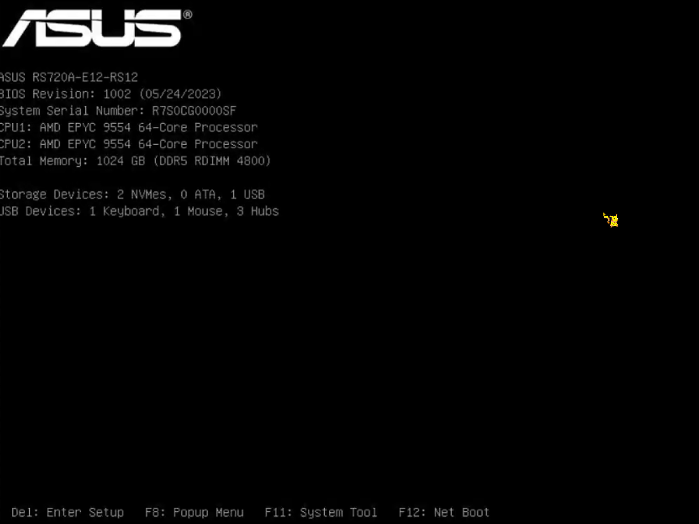
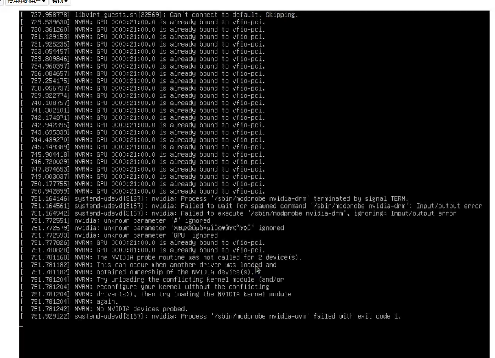

# 背景



服务器型号：ASUS RS720A - E12 - RS12

ASMB11-iKVM：是华硕（ASUS）的服务器管理解决方案

系统：Ubuntu20.04  

显卡：RTX4080 2张

需求：在Ubuntu20.04里面安装了虚拟机virsh，并在virsh里面安装了win11虚拟机，在win11里面可以调用显卡以及使用，
现在想宿主机能使用显卡，虚拟机不需要使用了。

# 移除virsh使用显卡

```
1. 查看正在运行的虚拟机
sudo virsh list
2. 查看所有虚拟机（包括关机状态）
sudo virsh list --all
3. 关闭在运行的虚拟机（使用destroy强制关闭）
sudo virsh shutdown <虚拟机名称>
sudo virsh destroy  <虚拟机名称>
4. 查看目前宿主机识别到的显卡
sudo lspci -nn | grep VGA 
sudo lspci | grep -i nvidia
5. 查看虚拟机的详细信息（这里查看是否有分配显卡）
sudo virsh dumpxml <虚拟机名称> | grep -i -A5 "video\|display\|graphics"
——————————————————————————————————————————————————————————————————————————————————————
(base) zhangxuan@ubuntu:~$ sudo virsh dumpxml windows11 | grep -i -A5 "video\|display\|graphics"
        <graphics type='spice' autoport='yes'>
          <listen type='address'/>
          <image compression='off'/>
        </graphics>
        <sound model='ich9'>
          <address type='pci' domain='0x0000' bus='0x00' slot='0x1b' function='0x0'/>
        </sound>
        <video>
          <model type='qxl' ram='65536' vram='65536' vgamem='16384' heads='1' primary='yes'/>
          <address type='pci' domain='0x0000' bus='0x00' slot='0x01' function='0x0'/>
        </video>
        <hostdev mode='subsystem' type='pci' managed='yes'>
          <source>
            <address domain='0x0000' bus='0x21' slot='0x00' function='0x0'/>
          </source>
          <address type='pci' domain='0x0000' bus='0x06' slot='0x00' function='0x0'/>
——————————————————————————————————————————————————————————————————————————————————————
可以看到物理显卡直通（PCI 设备）hostdev段里面有bus='0x21'（0x21就是pci设备（显卡设备）的地址）

6. 备份当前的虚拟机配置/恢复备份
sudo virsh dumpxml  <虚拟机名称> > ~/windows11_backup_$(date +%Y%m%d).xml
sudo virsh define ~/windows11_backup_$(date +%Y%m%d).xml
7. 编辑虚拟机配置，移除直通的显卡（需要使用vim打开请使用EDITOR环境变量）
sudo virsh edit <虚拟机名称>
sudo EDITOR=vim virsh edit  <虚拟机名称>
找到包含显卡 PCI 地址的 <hostdev> 段落（通常有多个，对应不同显卡）。删除整个 <hostdev> 段落（从 <hostdev> 到 </hostdev>）

8.确认是否删除成功（如果输出为空或不再包含显卡 PCI 地址，则删除成功。）
sudo virsh dumpxml  <虚拟机名称> | grep -i -A5 "hostdev"
9.重启电脑
reboot
```

# 移除主机上的GPU直通配置

```
1.编辑GRUB配置文件
sudo vim /etc/default/grub
2.删除或注释掉与 IOMMU 和 vfio 相关的参数（如果有）（没有就不用管），例如：
- GRUB_CMDLINE_LINUX_DEFAULT="quiet splash intel_iommu=on iommu=pt vfio-pci.ids=1002:67df,10de:1b80"
+ GRUB_CMDLINE_LINUX_DEFAULT="quiet splash"

3.更新GRUB
sudo update-grub
4.移除 vfio 模块配置
sudo vim /etc/modules
删除或注释掉与 vfio 相关的行（如果有，没有就不管）例如：
- vfio
- vfio_iommu_type1
- vfio_pci

5. 更新initramfs
sudo update-initramfs -u
6. 重启电脑reboot
```

#  安装显卡驱动

显卡驱动安装完成后，发现还是不行，如下：

(base) zhangxuan@ubuntu:~$ nvidia-smi NVIDIA-SMI has failed because it couldn't communicate with the NVIDIA driver. Make sure that the latest NVIDIA driver is installed and running.


root@ubuntu:/sys/bus/pci/drivers# sudo dkms status nvidia-srv, 570.133.20, 5.15.0-139-generic, x86_64: installed

根据 `dkms status` 输出，NVIDIA 驱动（版本 `570.133.20`）已成功为内核 `5.15.0-139-generic` 安装了模块，但 `nvidia-smi` 仍报错，说明可能是 **驱动未加载** 或 **GPU 仍被其他驱动占用**

(base) zhangxuan@ubuntu:/sys/bus/pci/devices$ dmesg | grep -i nvidia 
[   18.076420] nvidia: loading out-of-tree module taints kernel. 
[   18.076430] nvidia: module license 'NVIDIA' taints kernel. 
[   18.093262] nvidia: module verification failed: signature and/or required key missing - tainting kernel 
[   18.192214] nvidia-nvlink: Nvlink Core is being initialized, major device number 505 
[   18.234566] NVRM: The NVIDIA probe routine was not called for 2 device(s).               
NVRM: obtained ownership of the NVIDIA device(s).               
NVRM: driver(s)), then try loading the NVIDIA kernel module 
[   18.234572] NVRM: No NVIDIA devices probed. 
[   18.270665] nvidia-nvlink: Unregistered Nvlink Core, major device number 505 
[   19.367337] nvidia-nvlink: Nvlink Core is being initialized, major device number 505 
[   19.395150] NVRM: The NVIDIA probe routine was not called for 2 device(s).              
 NVRM: obtained ownership of the NVIDIA device(s).               
NVRM: driver(s)), then try loading the NVIDIA kernel module 
[   19.395157] NVRM: No NVIDIA devices probed. [   19.429931] 
根据你提供的 `dmesg` 日志，核心问题是 **NVIDIA 驱动模块签名不被系统信任**（`module verification failed`）和 **驱动无法探测到显卡**（`No NVIDIA devices probed`）


检查1：验证Secure Boot是否已经关闭

mokutil --sb-state

- 若输出 `SecureBoot disabled`，说明已关闭；否则需重新进 BIOS 确认。


如果以上都还是不行，请参考问题的解决方案

# 问题



安装显卡成功后，发现还是不行，无法使用显卡，以及开机的时候，有提示

739.322774] NVRM: GPU 0000:21:00.0 is already bound to vfio-pci.
740.108757] NvRM: GPU 0000:21:00.0 is already bound to vfio-pci

这里表示了显卡已经绑定到了vfio，说明系统在启动时自动将显卡分配给了虚拟机直通（GPU Passthrough）

```
一、检查当前 vfio 绑定状态
1.查看 vfio 模块加载情况
lsmod | grep -e vfio -e iommu
若输出包含vfio_pci、vfio_iommu_type1等模块，说明 vfio 已激活。（也可能没有显示）

2.查看被 vfio 绑定的设备
dmesg | grep -i vfio
记录显示为vfio-pci: add [PCI设备ID]的显卡信息（如01:00.0）。

二、解除 vfio 对显卡的绑定
1. 修改 GRUB 启动参数（禁用 IOMMU）
IOMMU 是 vfio 直通的前提，禁用后 vfio 将无法绑定设备：
sudo vim /etc/default/grub

2.找到GRUB_CMDLINE_LINUX行，（在末尾）添加参数：
GRUB_CMDLINE_LINUX="quiet splash intel_iommu=off amd_iommu=off"
Intel 平台用intel_iommu=off，AMD 用amd_iommu=off，双平台可同时添加。

2.更新GRUB
sudo update-grub

三、移除 vfio-pci 配置（关键步骤）
1. 检查modprobe配置中是否强制绑定显卡到 vfio（可能会没有这个文件）：
sudo vim /etc/modprobe.d/vfio.conf
sudo vim /etc/modprobe.d/blacklist.conf

2. 若发现类似以下内容（包含显卡 PCI ID），将其注释或删除：
# 原配置（示例，PCI ID需与实际匹配）
options vfio-pci ids=10de:2489,10de:1aef
blacklist nvidia

3. 同时检查/etc/modules-load.d/目录下的文件（如vfio.conf，没有则不管），移除 vfio 相关加载项：
sudo vim /etc/modules-load.d/vfio.conf
# 删除或注释掉 vfio_pci

4. 重启电脑
reboot

四、检查
1.显卡是否归属于主机
lspci -v | grep -i vga
# 若显示"Kernel driver in use: nvidia"或"nouveau"，说明绑定成功。

2.vfio 模块是否卸载
lsmod | grep -e vfio -e iommu
# 若输出为空，说明vfio已禁用。

3.检查当前显卡的绑定驱动
ls -l /sys/bus/pci/devices/0000:21:00.0/driver
ls -l /sys/bus/pci/devices/0000:81:00.0/driver
正常宿主机用 NVIDIA 驱动的话，应该指向 /bus/pci/drivers/nvidia 之类；
如果还指向 vfio-pci，就是还没有解绑好，还需要解绑重新绑定。例如：
root@ubuntu:/sys/bus/pci/devices/0000:21:00.0# ls -l /sys/bus/pci/devices/0000:21:00.0/driver
lrwxrwxrwx 1 root root 0 6月  27 01:31 /sys/bus/pci/devices/0000:21:00.0/driver -> ../../../../bus/pci/drivers/vfio-pci
root@ubuntu:/sys/bus/pci/devices/0000:21:00.0# ls -l /sys/bus/pci/devices/0000:81:00.0/driver
lrwxrwxrwx 1 root root 0 6月  27 01:31 /sys/bus/pci/devices/0000:81:00.0/driver -> ../../../../bus/pci/drivers/vfio-pci

五、继续vfio解绑排查
1. 先卸载 vfio 相关模块（避免干扰）
modprobe -r vfio_pci
modprobe -r vfio_iommu_type1
modprobe -r vfio
如果卸载失败，说明还有设备依赖 vfio，可以先不管，后面步骤做对了也能覆盖。

2. # 或查看 VFIO 绑定的设备
ls /sys/bus/pci/drivers/vfio-pci/

3.创建黑名单文件，阻止 vfio-pci 模块加载
sudo vim /etc/modprobe.d/blacklist-vfio.conf
blacklist vfio_pci
blacklist vfio_iommu_type1
blacklist vfio
install vfio-pci /bin/fals  # 阻止 vfio-pci 加载
options nvidia NVreg_OpenRmEnableUnsupportedGpus=1  # 强制支持非认证 GPU

4.更新
sudo update-initramfs -u

5.还是不行vfio还是被加载进来
# 搜索所有包含vfio的配置文件
sudo grep -r "vfio" /etc/
——————————————————————————————————————————————————————————————————————————————————————
(base) zhangxuan@ubuntu:~$ sudo grep -r "vfio" /etc/
/etc/modprobe.d/blacklist-vfio.conf:blacklist vfio
/etc/modprobe.d/blacklist-vfio.conf:blacklist vfio_iommu_type1
/etc/modprobe.d/blacklist-vfio.conf:blacklist vfio-pci
/etc/modprobe.d/nvidia-priority.conf:install vfio-pci /bin/false  # 阻止 vfio-pci 加载
/etc/default/grub:GRUB_CMDLINE_LINUX_DEFAULT="quiet splash modprobe.blacklist=vfio-pci,iommu=off"
/etc/apparmor.d/libvirt/libvirt-74e33bc5-d3a5-4f40-a8bf-2e211536825d.files:  "/dev/vfio/vfio" rw,
/etc/apparmor.d/libvirt/libvirt-74e33bc5-d3a5-4f40-a8bf-2e211536825d.files:  "/dev/vfio/[0-9]*" rw,
/etc/apparmor.d/usr.sbin.libvirtd:  # Needed for vfio
/etc/apparmor.d/abstractions/libvirt-qemu:  # for vfio hotplug on systems without static vfio (LP: #1775777)
/etc/apparmor.d/abstractions/libvirt-qemu:  /dev/vfio/vfio rw,
/etc/initramfs-tools/scripts/init-top/vfio.sh: echo "vfio-pci" > /sys/bus/pci/devices/$dev/driver_override
/etc/initramfs-tools/scripts/init-top/vfio.sh: echo "$dev" > /sys/bus/pci/drivers/vfio-pci/bind
——————————————————————————————————————————————————————————————————————————————————————
步骤 1：修改 AppArmor 配置（允许 NVIDIA 驱动访问 GPU）
# 修改 libvirt 的 AppArmor 配置
sudo nano /etc/apparmor.d/libvirt/libvirt-74e33bc5-d3a5-4f40-a8bf-2e211536825d.files
找到以下行并注释掉（在行前加 #）：
#  "/dev/vfio/vfio" rw,
#  "/dev/vfio/[0-9]*" rw,
保存后重启 AppArmor：
sudo systemctl restart apparmor

步骤 2：删除 initramfs 中的 vfio 启动脚本
initramfs 是系统启动初期加载的临时文件系统，其中的 vfio.sh 脚本会在启动时绑定 GPU 到 vfio。删除该脚本：
sudo rm /etc/initramfs-tools/scripts/init-top/vfio.sh
更新 initramfs：
sudo update-initramfs -u


步骤 3：清理其他潜在的 vfio 配置
修改 libvirtd 的 AppArmor 配置：
sudo nano /etc/apparmor.d/usr.sbin.libvirtd
注释掉与 vfio 相关的行（通常包含 vfio 关键词）：
# Needed for vfio
修改 qemu 的 AppArmor 配置：
sudo nano /etc/apparmor.d/abstractions/libvirt-qemu
注释掉以下行：
#  /dev/vfio/vfio rw,
```

最后重启电脑即可，如果还是不行，就在重新卸载驱动，重新安装一遍！