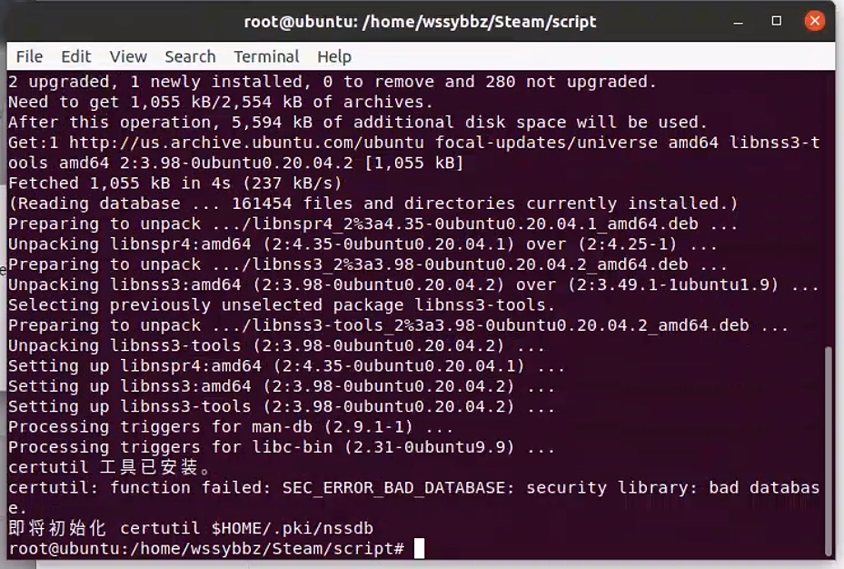
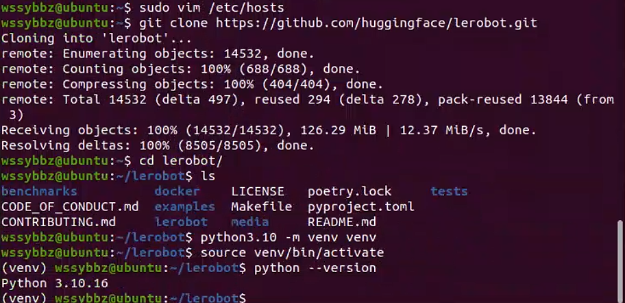

## 方案1-安装Watt Toolkit

用途：通过使用Watt Toolkit的网络加速来，解决GitHub访问不了（失效，不起作用）

```
wssybbz@ubuntu:~$ wget https://gitee.com/rmbgame/SteamTools/releases/download/3.0.0-rc.13/Steam%20%20_v3.0.0-rc.13_linux_x64.tgz
wssybbz@ubuntu:~$ mv "Steam  _v3.0.0-rc.13_linux_x64.tgz" Steam_Tools_v3.0.0-rc.13_linux_x64.tgz
wssybbz@ubuntu:~$ mkdir Steam
wssybbz@ubuntu:~$ tar zxvf Steam_Tools_v3.0.0-rc.13_linux_x64.tgz  -C  Steam
wssybbz@ubuntu:~$ sudo ./Steam++.sh    #启动Watt Toolkit
```

启动完成后，需要开启网络加速还需要运行environment_check.sh安装依赖环境（如图）


点击Yes后，会自动打开文件资源管理器，打开脚本所在的位置（如图）

鼠标--右击---选择Open in Terminal 打开命令终端（如图）


打开终端后，输入以及命令（如图）

sudo bash environment_check.sh 




安装完成之后就可以再次启动网络加速（如图）

在NetWork routing中往下滑，选择Github，点击Start routing即可


其他：如果出现证书问题就按照官方指引操作即可


## 方案2-使用/etc/hosts实现

```
wssybbz@ubuntu:~$ sudo apt update && sudo apt install vim
wssybbz@ubuntu:~$ sudo chmod a+w /etc/hosts
wssybbz@ubuntu:~$ sudo cp /etc/hosts /etc/hosts.bak
wssybbz@ubuntu:~$ sudo gedit /etc/hosts

把这些内容全部复制粘贴到/etc/hosts中
#Github Hosts Start
#Update Time: 2025-01-17
#Project Address: https://github.com/maxiaof/github-hosts
#Update URL: https://raw.githubusercontent.com/maxiaof/github-hosts/master/hosts
140.82.113.25 alive.github.com
140.82.112.25 live.github.com
185.199.108.154 github.githubassets.com
140.82.113.22 central.github.com
185.199.109.133 desktop.githubusercontent.com
185.199.110.133 camo.githubusercontent.com
185.199.111.133 github.map.fastly.net
146.75.121.194 github.global.ssl.fastly.net
140.82.121.3 gist.github.com
185.199.111.153 github.io
140.82.121.3 github.com
192.0.66.2 github.blog
140.82.121.6 api.github.com
185.199.111.133 raw.githubusercontent.com
185.199.109.133 user-images.githubusercontent.com
185.199.111.133 favicons.githubusercontent.com
185.199.108.133 avatars5.githubusercontent.com
185.199.108.133 avatars4.githubusercontent.com
185.199.109.133 avatars3.githubusercontent.com
185.199.110.133 avatars2.githubusercontent.com
185.199.108.133 avatars1.githubusercontent.com
185.199.111.133 avatars0.githubusercontent.com
185.199.108.133 avatars.githubusercontent.com
140.82.121.10 codeload.github.com
3.5.6.124 github-cloud.s3.amazonaws.com
54.231.202.81 github-com.s3.amazonaws.com
52.217.139.89 github-production-release-asset-2e65be.s3.amazonaws.com
16.182.65.233 github-production-user-asset-6210df.s3.amazonaws.com
52.216.213.241 github-production-repository-file-5c1aeb.s3.amazonaws.com
185.199.109.153 githubstatus.com
140.82.112.18 github.community
51.137.3.17 github.dev
140.82.113.21 collector.github.com
13.107.42.16 pipelines.actions.githubusercontent.com
185.199.108.133 media.githubusercontent.com
185.199.108.133 cloud.githubusercontent.com
185.199.109.133 objects.githubusercontent.com
#Github Hosts End

粘贴完成后，就保存退出 
```

如果你需要获取最新的hosts，可以点击这个链接获取（一般只有Github访问不了才需要更新）

[maxiaof/github-hosts: 通过修改Hosts解决国内Github经常抽风访问不到,每日更新](https://github.com/maxiaof/github-hosts)


## 安装配置环境

```
sudo apt update
sudo apt install software-properties-common -y
sudo add-apt-repository ppa:deadsnakes/ppa -y
sudo apt update
sudo apt install python3.10 python3.10-venv -y
sudo apt install git

# 安装完成后，可以验证一下python3.10
python3.10 --version

# 克隆项目
wssybbz@ubuntu:~$ git clone https://github.com/huggingface/lerobot.git
Cloning into 'lerobot'...
remote: Enumerating objects: 14532, done.
remote: Counting objects: 100% (688/688), done.
remote: Compressing objects: 100% (404/404), done.
remote: Total 14532 (delta 497), reused 294 (delta 278), pack-reused 13844 (from 3)
Receiving objects: 100% (14532/14532), 126.29 MiB | 12.37 MiB/s, done.
Resolving deltas: 100% (8505/8505), done.
# 进入项目目录
wssybbz@ubuntu:~$ cd lerobot/
# 创建虚拟venv环境
wssybbz@ubuntu:~/lerobot$ python3.10 -m venv venv
# 激活环境
wssybbz@ubuntu:~/lerobot$ source venv/bin/activate
```


