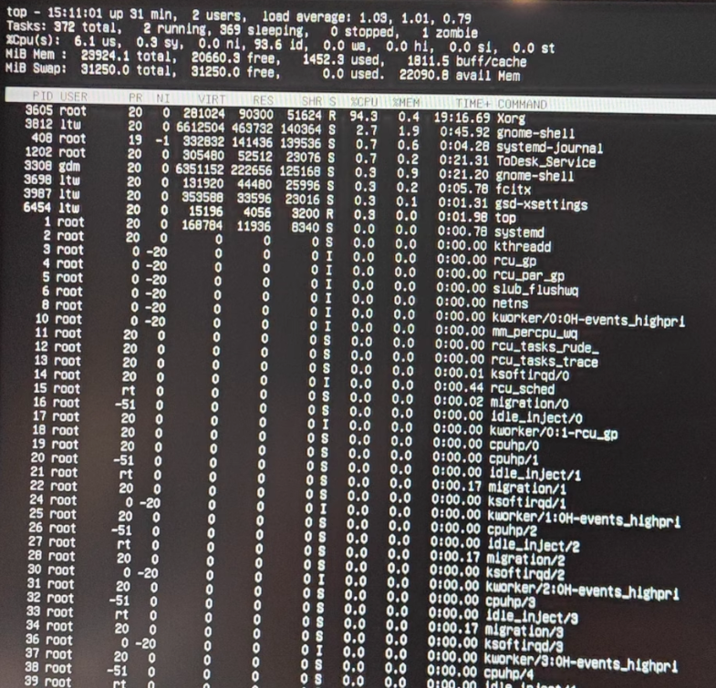
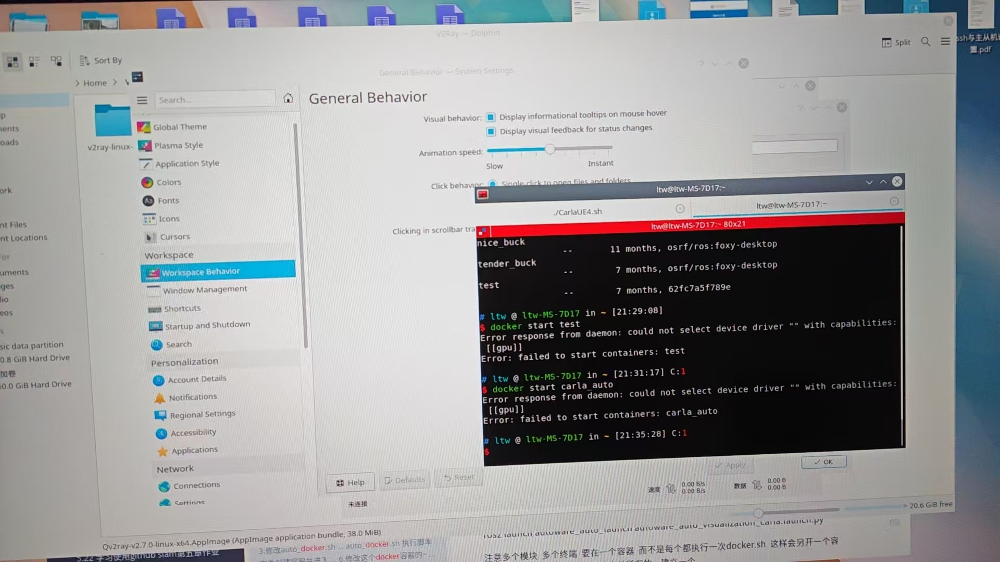

# 背景

Ubuntu20.04 默认的桌面，问题是：打开设置，或者是终端，其他的桌面窗口，对窗口进行拖拽移动，就会卡死，然后Xorg就占用率100%，这个桌面环境动不了一点，但是可以切换到tty使用是没问题的



## 尝试重装（不行）

```
sudo apt-get update

sudo apt-get install --reinstall ubuntu-desktop
```


### 解决方案（换别的桌面环境使用）

```
sudo apt install kde-full

vim  ~/.dmrc

[Desktop]
Session=plasma
```

