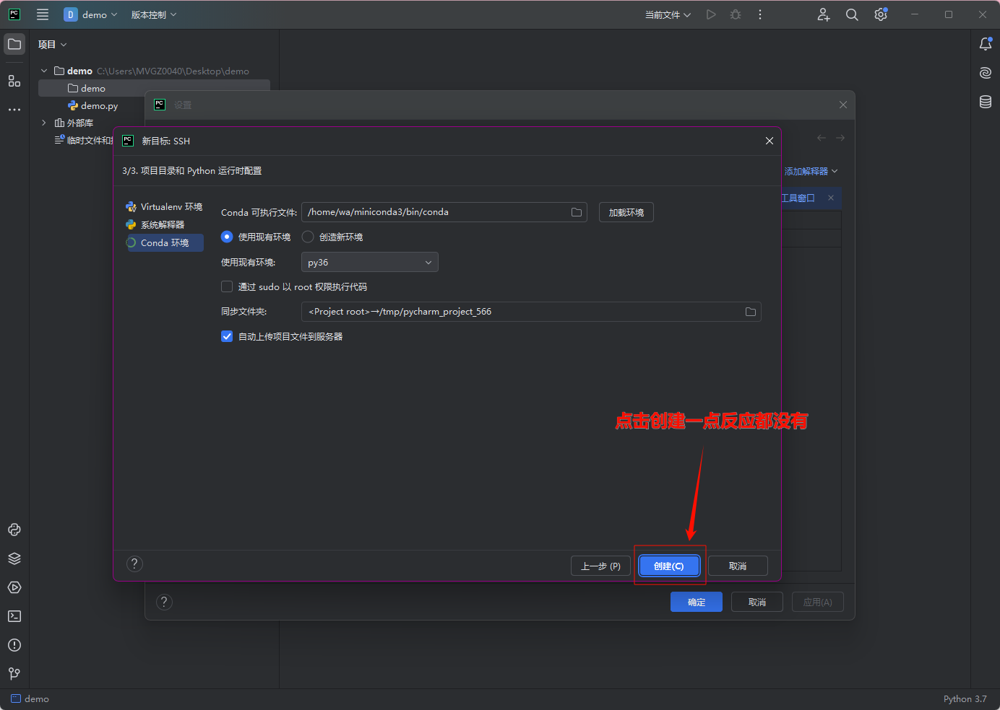
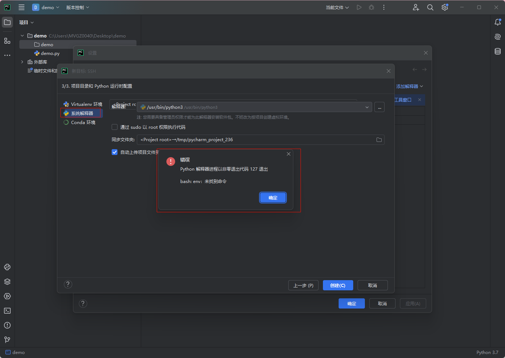
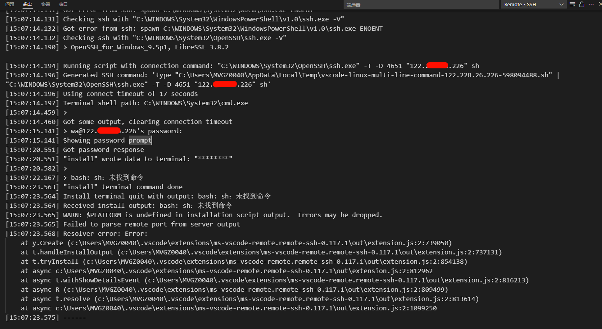
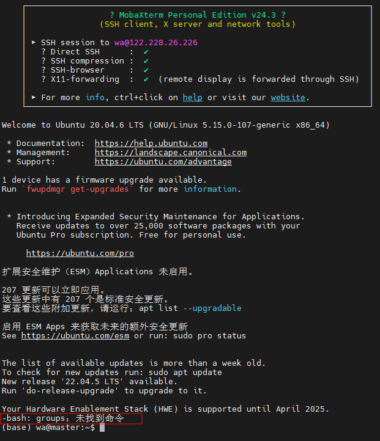
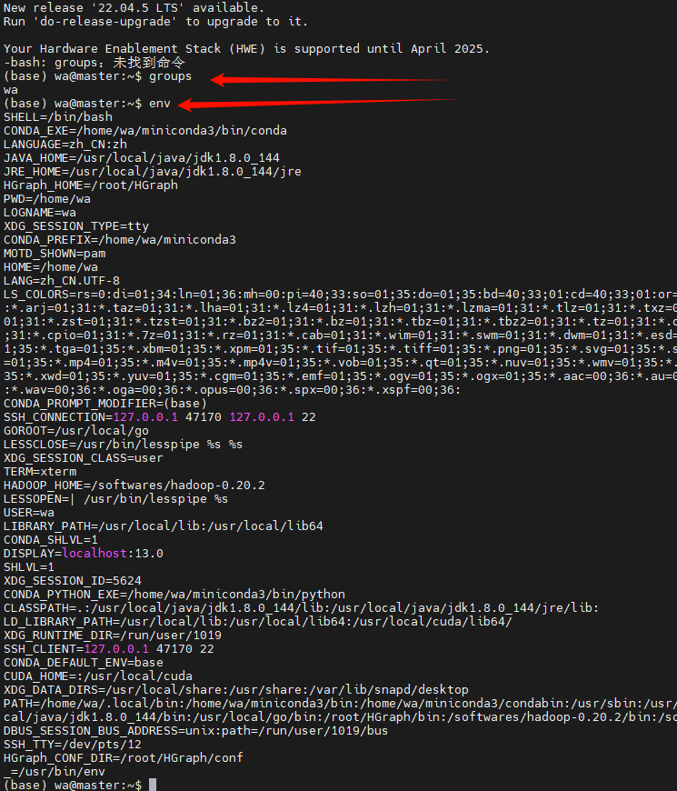
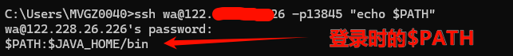
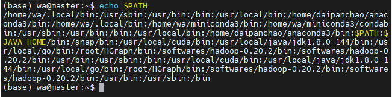
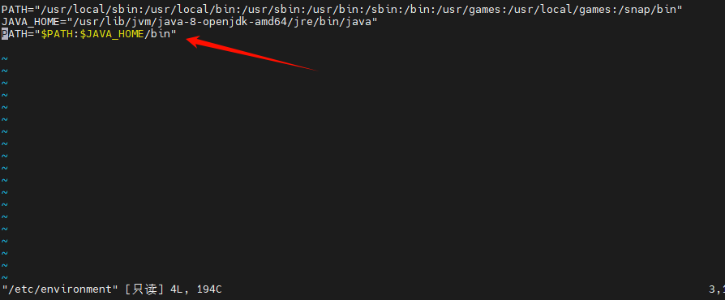

# 背景

一台Ubuntu20.04的服务器，使用pycharm的SSH配置服务器的，然后配置远程配置Python解释器，使用conda，但是一切都配置好，点击创建一点反应都没有。然后切换成为系统解释器，点击确定，就弹出bash： env 未找到命令。





Pycharm不行，那么使用Vscode来连接呢？输入密码后，结果显而易见，也不行，直接就连接不上，如果你注意看的话，会发现报错说什么bash：sh：找不到命令


那么我直接使用MobaXterm连接，你细心的话，你会发现有个报错-bash：groups：未找到命令



但是进去系统后使用是可以使用的，groups可以使用，env可以使用。



得出的结论就是问题都是在出现进入shell之前的环境变量有问题，所有我检查~/.bash_profile`、`~/.bashrc `、` /etc/profile 都没有问题，我甚至去检查了会不会是因为登录提示导致的问题。

登录提示的显示顺序取决于配置优先级：

1. **本地登录前**：`/etc/issue`
2. **SSH登录前**：`/etc/ssh/banner`
3. **登录后动态信息**：`/etc/update-motd.d/` 脚本
4. **登录后静态信息**：`/etc/motd`

```
ls /etc/update-motd.d/ *# 文件名以数字开头，按顺序执行（如 00-header、50-motd-news）

除登录后提示外，SSH连接时也可自定义连接前的警告信息：（SSH登录前的Banner）
sudo nano /etc/ssh/sshd_config 
# 取消注释并修改 Banner 路径：
Banner /etc/ssh/my_banner 

```

检查后发现也没有问题。

顺藤摸瓜，了解到，在 Bash 登录时加载的配置文件与登录类型有所不同，
（交互式/非交互式、登录/非登录）密切相关

### 一、**登录式 Shell（Login Shell）**

当通过 SSH 登录或使用 `bash --login` 启动时，加载顺序如下：

1. `/etc/profile`

   - **全局配置文件**，对所有用户生效
   - 会调用 `/etc/profile.d/*.sh` 目录下的所有脚本

2. 用户级配置文件（优先级顺序）

   - **`~/.bash_profile`** → **`~/.bash_login`** → **`~/.profile`**
   - 系统按顺序检查，找到第一个存在的文件后停止加载其他文件

3. 嵌套加载的其他文件

   - 如果 `~/.bash_profile` 存在，通常会调用 `~/.bashrc` 和 `/etc/bashrc`（或 `/etc/bash.bashrc` ，取决于发行版）

二、**非登录式 Shell（Non-Login Shell）**

当通过终端直接启动或运行脚本时，加载以下文件：

1. `~/.bashrc`
   - 用户级配置，包含别名、函数等
2. `/etc/bash.bashrc` （Ubuntu）或 `/etc/bashrc`（CentOS）
   - 全局 Bash 配置，如 PS1 提示符、历史记录设置

------

### 三、**其他相关文件**（关键点）

1. `/etc/environment`
   - 系统级环境变量文件（由 `pam_env` 模块加载，不属于 Bash 专属）
   
2. `~/.bash_logout`
   
   - 用户退出登录 Shell 时执行（如清理临时文件）
   
3. `/etc/profile.d/*.sh`
   
   - 存放全局环境变量和初始化脚本的扩展目录
   
4. `~/.bash_aliases`
   
   - 用户自定义别名文件（需在 `~/.bashrc` 中手动引用）
   
   ## 四、**加载逻辑总结**

| **登录 Shell**   | `/etc/profile` → `~/.bash_profile`/`.bash_login`/`.profile` → `~/.bashrc` |
| ---------------- | ------------------------------------------------------------ |
| **非登录 Shell** | `~/.bashrc` → `/etc/bash.bashrc` （或 `/etc/bashrc`）        |
| **SSH 远程命令** | 仅加载 `~/.bashrc`（非交互式模式）                           |

### 五、**调试与验证**

- 查看当前 Shell 类型

  ```
  echo $0   # 输出 "-bash" 表示登录 Shell，输出 "bash" 表示非登录 Shell
  ```


得出结论就是我在 `登录时` 和 `登录后` 的 `$PATH` 环境变量是不一样的

而pycharm和vscode都是在登录时去使用触发对应的命令，从而导致我找不到env啊，sh啊命令找不到。那么我们就来分析一下

一、登录前获取PATH变量（SSH登录时）

1在SSH连接时直接输出PATH

```
ssh user@ip -p端口 "echo \$PATH"
```

- 这会显示登录初始化阶段的PATH值

- 示例输出

- ```
  C:\Users\MVGZ0040>ssh mvit@10.192.167.208 "echo $PATH"
  
  /usr/local/sbin:/usr/local/bin:/usr/sbin:/usr/bin:/sbin:/bin:/usr/games:/usr/local/games:/snap/bin
  ```

2对比登录后的PATH变量

- 登录后执行：

  ```
  echo $PATH 
  ```

- 示例输出（简写）：

  ```
  (base) mvit@mvit:~$ echo $PATH
  
  /home/mvit/miniconda3/bin:/home/mvit/miniconda3/condabin:/usr/local/sbin:/usr/local/bin:/usr/sbin:/usr/bin:/sbin:/bin:/usr/games:/usr/local/games:/snap/bin
  ```

### 四、高级调试技巧

1. 追踪配置文件加载顺序

   ```
   bash复制# 在SSH命令中打印加载流程 
   ssh user@ip -p端口 "bash -x -l -c 'echo \$PATH'"
   ```

   - `-x` 参数显示详细执行过程

2. 对比不同Shell类型的PATH

   ```
   bash复制# 登录式Shell 
   bash -l -c 'echo $PATH'
   
   # 非登录式Shell 
   bash -c 'echo $PATH'
   ```


所以我在试这台机子的时候，就出现了问题，登录时的$PATH的环境很明显不对



而登录后呢，就正常了



### 二、分析差异原因

#### 1. **配置文件加载差异**

- **登录前（SSH）**：仅加载 `/etc/profile` 和 `/etc/environment`（系统级配置）。
- **登录后（交互式Shell）**：额外加载 `~/.bashrc`、`~/.bash_profile`（用户级配置），可能添加自定义路径（如 `/snap/bin`）。

#### 2. **典型路径差异示例**

| 路径           | 登录前是否包含 | 登录后是否包含 | 来源配置文件                |
| -------------- | -------------- | -------------- | --------------------------- |
| `/usr/sbin`    | ✔️              | ✔️              | `/etc/profile`              |
| `/snap/bin`    | ❌              | ✔️              | `~/.bashrc` 或 `~/.profile` |
| `~/.local/bin` | ❌              | ✔️              | `~/.bashrc`                 |

### 三、具体操作步骤

1. **检查系统级配置文件**

   ```
   cat /etc/environment  # 系统全局PATH（优先级最低）
   cat /etc/profile       # 系统级环境变量（登录时加载）
   ```

2. **检查用户级配置文件**

   ```
   cat ~/.bashrc         # 非登录Shell加载（交互式终端）
   cat ~/.bash_profile   # 登录Shell加载（优先级高于~/.bashrc）
   ```


那么我这里看一下/etc/environment究竟修改了什么，这不就是登录时的变量嘛



# 总结

最后得出的结论就是因为修改了/etc/environment的内容导致了在登录时加载的环境变量不对，从而导致一系列问题，把最后面2条删掉即可解决问题。


