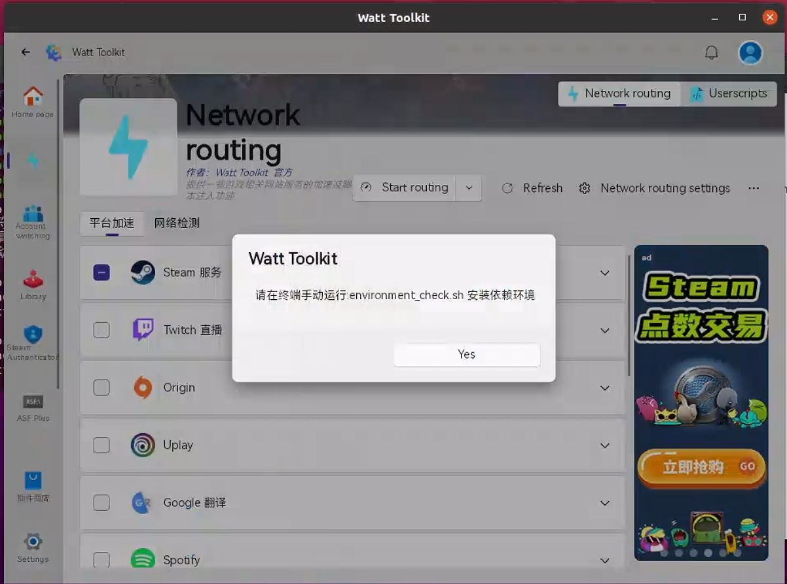
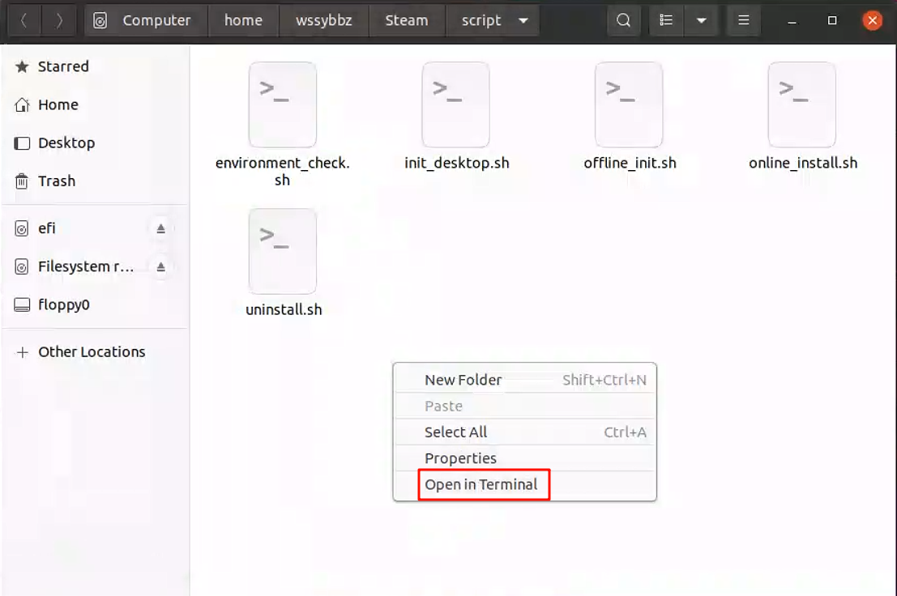
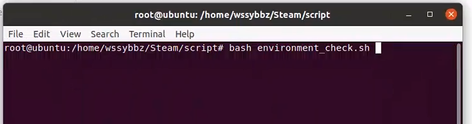
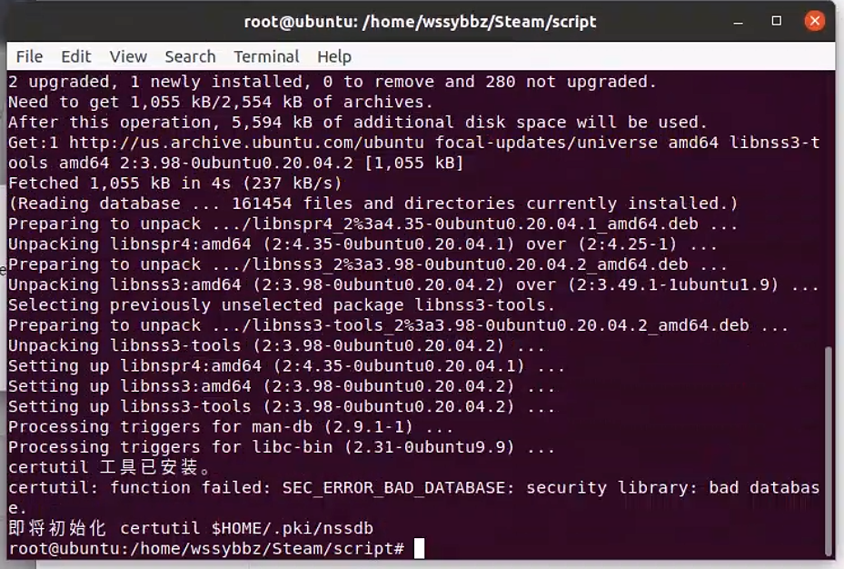
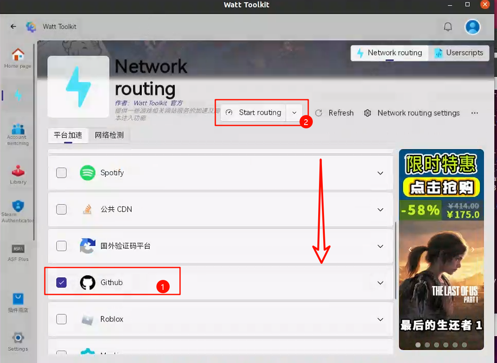
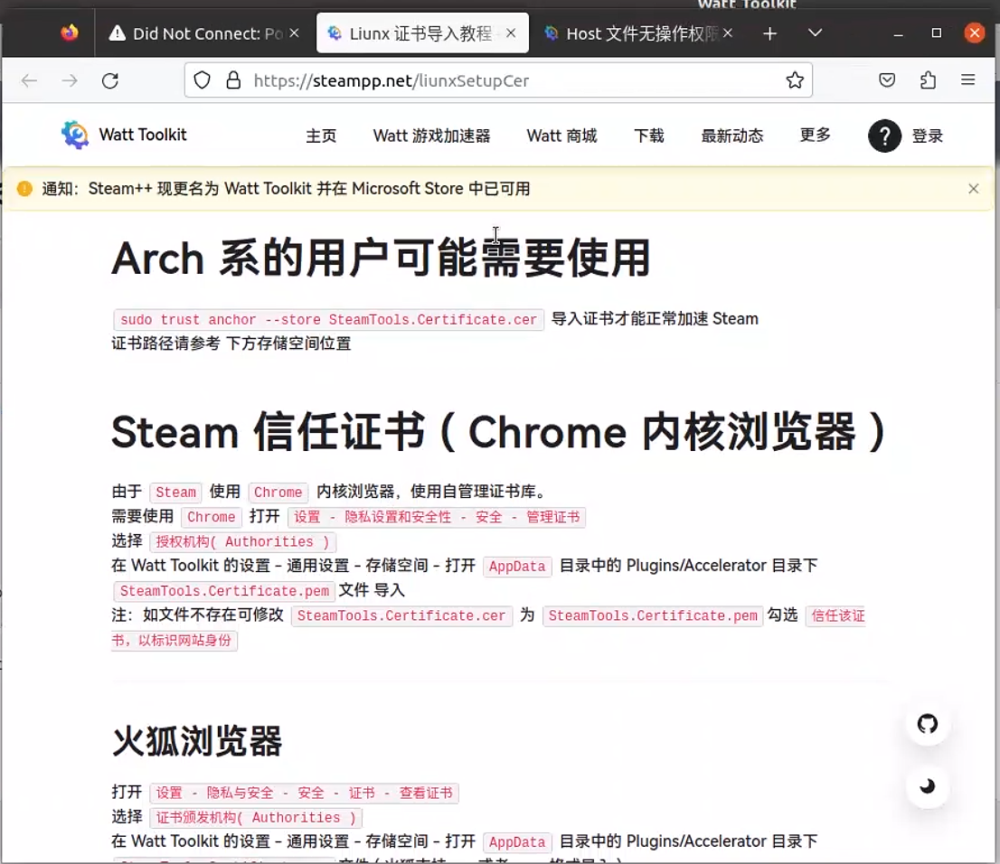
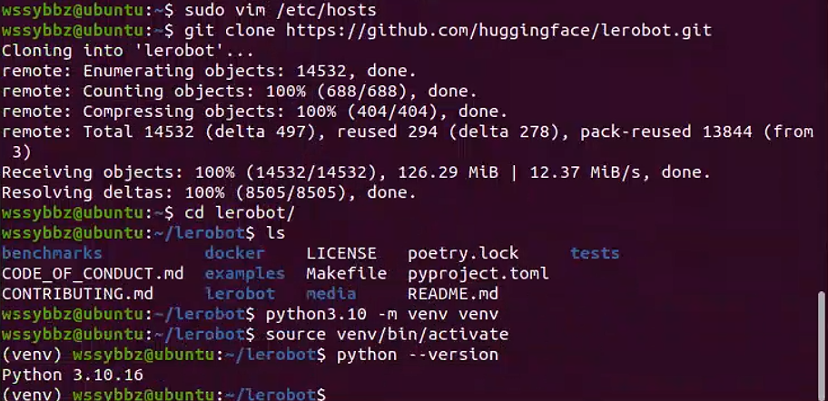

# 第一步

安装steamtools用来加速

<pre>wget https://gitee.com/rmbgame/SteamTools/releases/download/3.0.0-rc.13/Steam%20%20_v3.0.0-rc.13_linux_x64.tgz


mv "Steam  _v3.0.0-rc.13_linux_x64.tgz" Steam_Tools_v3.0.0-rc.13_linux_x64.tgz


mkdir Steam
wssybbz@ubuntu:~$ tar zxvf Steam_Tools_v3.0.0-rc.13_linux_x64.tgz  -C  Steam

sudo ./Steam++.sh
</pre>





root@ubuntu:/home/wssybbz/Steam/script# bash environment_check.sh 











sudo chmod a+w /etc/hosts


方案2：


[maxiaof/github-hosts: 通过修改Hosts解决国内Github经常抽风访问不到,每日更新](https://github.com/maxiaof/github-hosts)


安装python3.10和venv

```
sudo apt update
sudo apt install software-properties-common -y
sudo add-apt-repository ppa:deadsnakes/ppa -y
sudo apt update
sudo apt install python3.10 python3.10-venv -y

sudo apt install git
```


验证

python3.10 --version



克隆项目

wssybbz@ubuntu:~$ git clone https://github.com/huggingface/lerobot.git
Cloning into 'lerobot'...
remote: Enumerating objects: 14532, done.
remote: Counting objects: 100% (688/688), done.
remote: Compressing objects: 100% (404/404), done.
remote: Total 14532 (delta 497), reused 294 (delta 278), pack-reused 13844 (from 3)
Receiving objects: 100% (14532/14532), 126.29 MiB | 12.37 MiB/s, done.
Resolving deltas: 100% (8505/8505), done.

wssybbz@ubuntu:~$ cd lerobot/

wssybbz@ubuntu:~/lerobot$ python3.10 -m venv venv

wssybbz@ubuntu:~/lerobot$ source venv/bin/activate