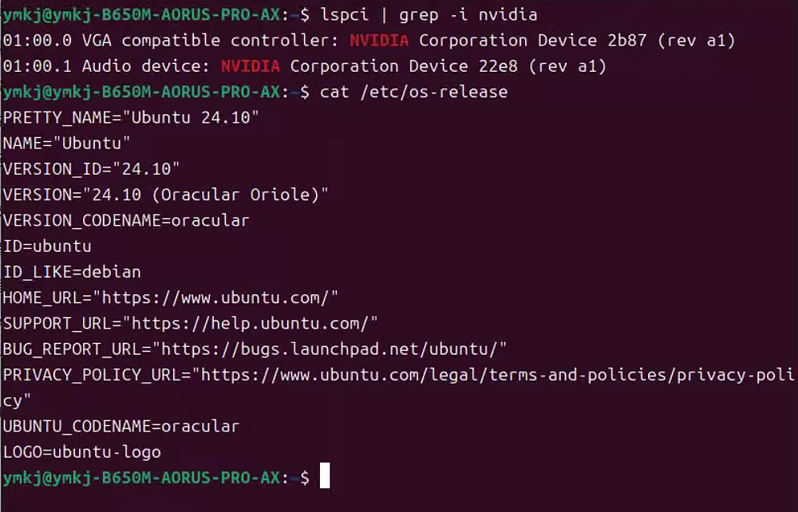

# 解决方案

## Ubuntu22.04安装显卡驱动，参考

[Ubuntu22.04安装CUDA、cudnn详细步骤_ubuntu怎么启用 dnn 模块-CSDN博客](https://blog.csdn.net/takedachia/article/details/130375718)

## ubuntu24.10/24.04 安装显卡rtx5090D

PS：请使用RUN的方式安装，apt方式安装570版本会失败！

