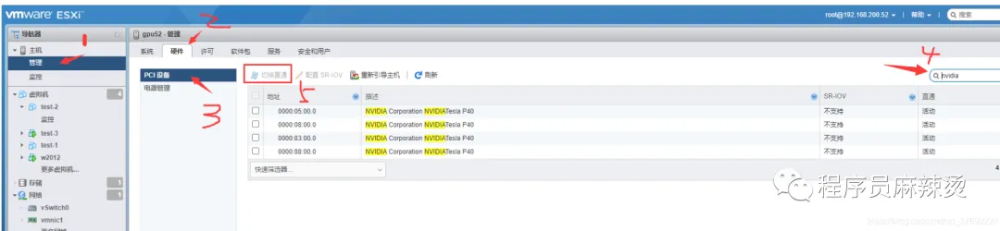
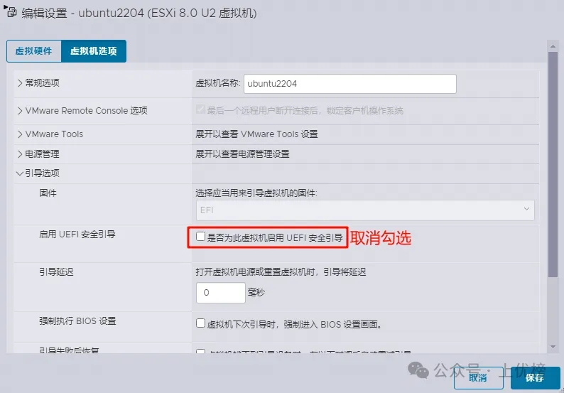
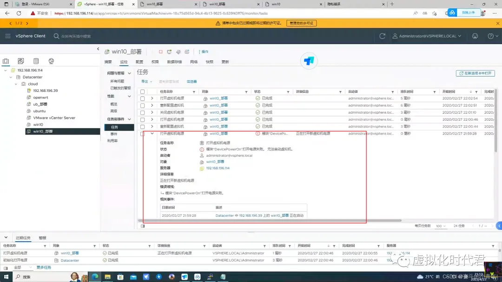

# ESXi显卡直通系列-集合

## 查看ESXi是否支持自己的显卡-点击跳转

https://www.vmware.com/resources/compatibility/search.php?deviceCategory=vsga


## 配置显卡直通

### 把显卡设置为直通（Linux）



重启后


这里要预留所有内存。我设置的内存是32G，点击预留所有内存后，内存配置里的预留所有客户机内存会被勾选。


**一定要配置上下面这三个参数**

```
pciPassthru.use64bitMMIO=TRUE

pciPassthru.64bitMMIOSizeGB=64 

hypervisor.cpuid.v0= FALSE

备注：MMIOSize设置为虚拟机分配的所有GPU显存大小的两倍
```


注意这里1



注意这里2

在编辑设置——虚拟机选项——编辑配置中搜索vga（Scalable Graphics Adapter | 可扩展图形适配器）关键词，将 svga.present的值修改为FALSE（关闭内置的虚拟显卡），将 svga.autodetect的值修改为 TRUE（开启显卡自动检测）。


注意这里3

•锁定全部内存

•设置 `hypervisor.cpuid.v0=FALSE`

•设置 `pciPassthru0.msiEnabled=FALSE`

•设置 `pciPassthru.use64bitMMIO=TRUE`

•设置 `pciPassthru.64bitMMIOSizeGB=24`（这个数字填写 2*GPU 显存总量。例如我的 3060 显存 12G，这里填写 24 即可）

### 把显卡设置为直通（Windows）

这里提醒一下，如果是新建一个要直通显卡的虚拟机，**不要勾选虚拟化嵌套功能**。已有的虚拟机也不要开启虚拟化嵌套功能，下面的步骤也会提到。


1、右击编辑要直通显卡的虚拟机，“编辑设置”


2、添加PCI设备，这里准备添加要直通的显卡


3、选中要直通的显卡，“保存”。如果要直通多张显卡，可以类推这样添加


4、取消开启CPU选项中的“硬件虚拟化”功能


5、编辑虚拟机的“内存”，勾选“预留所有客户机内存(全部锁定)”，这个选项的作用是将虚拟机的内存完全锁定，防止其他虚拟机或主机操作系统使用该内存，确保虚拟机在运行期间获得足够的内存


6、点击“虚拟机选项”-“高级”-“编辑配置”-“添加参数”，添加一行 键和值“ hypervisor.cpuid.v0 FALSE ”，如下图所示。添加这一行参数的作用，是绕过虚拟化检测，因为一些显卡驱动程序会检测虚拟化环境，并拒绝在虚拟机中运行。当然，你也可以先不添加这一行参数，看显卡是否能正常使用，比如在“设备管理器”中看到显卡的驱动是有黄色叹号的，则表示显卡未能正常使用


7、建议关闭虚拟机的UEFI安全引导。因为启用 UEFI 安全引导意味着虚拟机只能引导经过验证的签名代码，包括操作系统、引导加载程序和驱动程序，如果显卡驱动程序未经过windows签名，那意味着该驱动程序未经过操作系统验证，可能存在安全隐患或稳定性问题，操作系统会拒绝加载未签名的驱动程序，可能会导致直通显卡失败


8、保存以上的配置后，就可以重新打开虚拟机的电源来启动虚拟机了


虚拟机正常启动后，在“设备管理器”中就能看到刚才直通过来的NVIDIA Quadro K1200显卡了，并已自动安装上了驱动，显示出相应的显卡型号，运行正常，直通成功


# 安装NVIDIA驱动

官方论坛：[https://forums.developer.nvidia.com](https://forums.developer.nvidia.com)

### 检查系统是否开启 nouveau 驱动

Nouveau 是一个开源项目，旨在为 NVIDIA 图形处理器提供高质量的自由软件驱动程序。它由 Linux 内核中的 KMS 驱动（nouveau），Mesa 中的 Gallium3D 驱动，以及 Xorg DDX（xf86-video-nouveau）组成。
这个项目的目标是提供对 NVIDIA 显卡的完整支持，包括 2D/3D 加速、视频解码加速等功能。
Nouveau 驱动程序是通过逆向工程 NVIDIA 的专有驱动程序开发的，因此它不受 NVIDIA 官方的支持。

```
	#检查是否开启了 nouveau 
lsmod | grep nouveau    # 有输出代表已启用
-------------------------------------------
    ##禁用nouveau启动方法1 （没有则创建dist-blacklist.conf）
vim /lib/modprobe.d/dist-blacklist.conf
    #将 nvidiafb 配置注释掉。
        # blacklist nvidiafb
    #在尾部添加以下配置
        blacklist nouveau
        options nouveau modeset=0
    #保存退出
         :wq!
------------------------------------------
    ##禁用内核模块 nouveau启动方法2
vim /etc/modprobe.d/blacklist-nvidia-nouveau.conf
    #在尾部添加：
        blacklist nouveau
        options nouveau modeset=0   
    #保存退出
        :wq!
--------------------------------------------
   #重建 initramfs方法1（Centos）
重建 initramfs image（ initramfs 是一个临时的文件系统,其中包含了必要的设备如硬盘、网卡、文件系统等的驱动以及加载驱动的工具及其运行环境,比如基本的C库,动态库的链接加载器等。）
    # 备份一下
mv /boot/initramfs-$(uname -r).img /boot/initramfs-$(uname -r).img.bak 
    # 更新
dracut /boot/initramfs-$(uname -r).img $(uname -r) --force
    # 将重建的 initramfs 同步至内核
    # 安装依赖
yum install -y vim wget yum-util net-tools epel-release gcc gcc-c++ make dkms  
    # 同步至内核
yum install -y "kernel-devel-uname-r == $(uname -r)"
----------------------------------------------
    #重建initramfs方法2（Ubuntu）
sudo update-initramfs -u
-----------------------------------------
	#重建initramfs方法3（Fedora）
sudo dracut --force
-------------------------------------
	#重建initramfs方法4（OpenSUSE）（重新生成initrd）
sudo /sbin/mkinitrd
----------------------------------------
    #重启系统使配置生效
reboot
-------------------------------------------------
    #再次验证 nouveau 驱动是否已禁用
lsmod | grep nouveau  # 没输出代表禁用生效
```

### centos

```
yum install pciutils

# 检查是否发现显卡
lspci | grep -i nvidia  

dmesg | grep NVRM  #查看驱动无法启动原因
```

### Ubuntu

```
# 检查是否发现显卡
sudo lspci | grep -i nvidia
#更新系统的本地软件包列表，获取软件源中可用软件包的最新信息
sudo apt update
#然后查看Ubuntu官方软件源中的NVIDIA驱动程序，会显示出适用于系统中 NVIDIA 显卡的推荐驱动程序
sudo ubuntu-drivers devices

###如果提示sudo: ubuntu-drivers: command not found
###解决方法
sudo apt-get install ubuntu-drivers-common

#这里选择安装比较新的545版本进行安装，执行：
sudo apt install -y nvidia-driver-545
#等待驱动程序安装完成后，验证一下安装，运行以下命令查看显卡信息：         
nvidia-smi


注意：
nvidia-driver-xxx :这是适配大多数用户，一般情况下都可以安装这个
nvidia-driver-xxx-server ：这个适配服务器，有多块GPU调度等情况
nvidia-driver-xxx-open ：这个是开源版本，可以自己修改


报错获取更多信息：
cat /proc/driver/nvidia/version
cat /sys/module/nvidia/version
dkms status
 
nvidia - smi 无法与显卡驱动通信时，查看日志、报错及定位问题的方法有如下：
#可查看与 NVIDIA 服务直接相关的日志，如果在nvidia后加*则nvidia 开头的服务日志
journalctl -u nvidia

dmesg 用于显示内核环缓冲区的信息，也就是内核在启动过程中产生的信息
# 可提取与 NVIDIA 相关的内核信息，这些信息可能包含硬件检测、驱动加载等关键内容。
dmesg | grep -i nvidia
```

### 测试显卡是否成功

在浏览器中访问以下网址，如果图形正常显示，并且GPU占用正常，说明直通是成功的。

```
# 测试网址1
https://cznull.github.io/vsbm

# 测试网址2
http://gpu.jy6d.com/
```


### 卸载nvidia显卡驱动

```
方法一：
#先查看驱动以及版本安装情况，命令如下：
ls /usr/src | grep nvidia
 
#进入安装目录，用驱动自带卸载命令卸载，一般情况下能卸载干净
cd /usr/bin
ls nvidia-*
sudo nvidia-uninstall
 
#然后用上面的查看命令查看是否卸载干净，完成卸载
ls /usr/src | grep nvidia
 
#如果需要卸载干净所有英伟达驱动命令，如下
sudo apt-get remove --purge nvidia-*（/nvidia*)
sudo apt autoremove   # 此命令在万般无奈之下在使用，可能会卸载无辜软件，影响稳定性。。。
 
 
方法二：（推荐）
 
#直接卸载驱动
sudo ./显卡驱动包名称 --uninstall
 
#卸载两件套
sudo apt-get purge nvidia*
sudo apt-get autoremove
sudo reboot
```


# 问题报错

下图是错误信息，如图所示，



**四、解决过程**

1、首先检查显卡配置是否正确，设置无错误。


2、更改下虚拟机参数。如图所示

```
pciPassthru.use64bitMMIO=”TRUE” 
pciPassthru.64bitMMIOSizeGB=64
```


3、可正常开机


4、虚拟机已进入，正在安装驱动


5、安装完成，可正常显示Nvidia显卡驱动


# 参考链接

https://mp.weixin.qq.com/s/YdGJUDju9OuqBr6Dfv96pw

https://mp.weixin.qq.com/s/p9o4X25LX8xAVp_lUWzkHg

https://mp.weixin.qq.com/s/C4NKPSMErlhNkkTJSpcsEg

https://mp.weixin.qq.com/s/j1xqWQiR-70ac9w1b7N-3w

https://mp.weixin.qq.com/s/eHWKTPY1BLZO_nsw0UDUkw

[Ubuntu22.04 LTS 安装nvidia显卡驱动 - cyMessi - 博客园](https://www.cnblogs.com/cyMessi/p/18627184)
