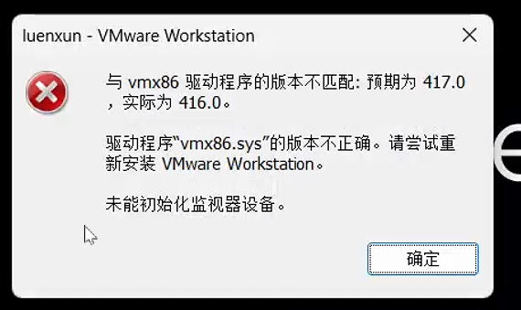
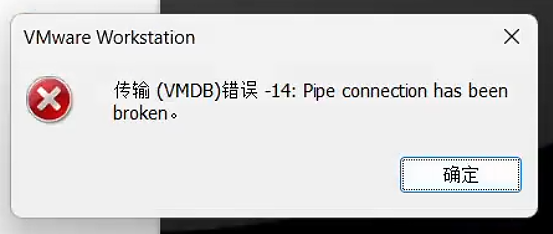
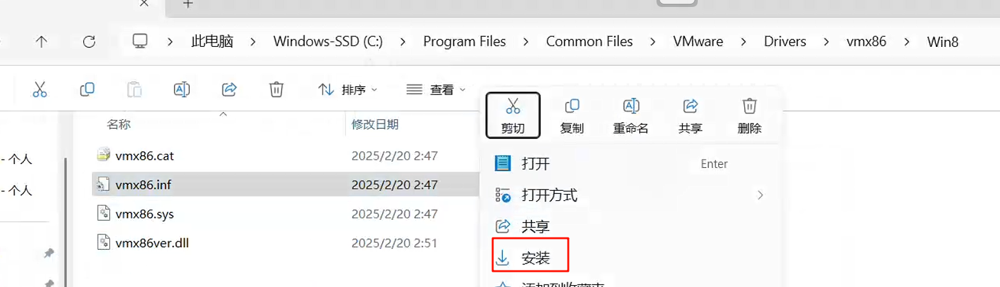
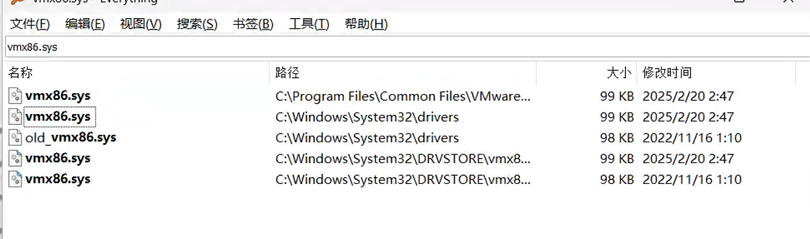

待更新

重装不生效

把所有是vmx86.sys都重命名，然后重启，然后安装vmware就可以了

# 参考：

[启动VMware时遇到“vmx86版本不匹配问题”的解决方法 - 墨天轮](https://www.modb.pro/db/617884)

[【亲测有效】解决虚拟机vmx86驱动程序的版本不匹配的问题_与 vmx86 驱动程序的版本不匹配: 预期为 417.0,实际为 416.0。 驱动程序“vmx8-CSDN博客](https://blog.csdn.net/weixin_63540954/article/details/136656099)

[VMware workstation 驱动程序的版本不匹配 - 知乎](https://zhuanlan.zhihu.com/p/403777914)