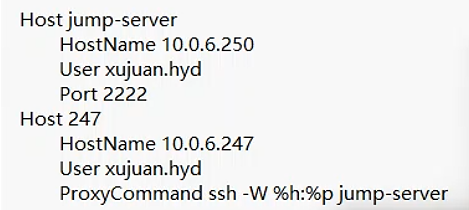
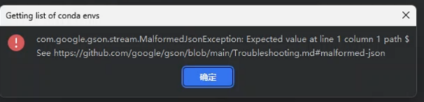

# 说明

本教程适用于Pycharm和VScode使用

编写时间：2024.11.28

## 建议

对于pycharm来说，直接使用ssh的转发(隧道)功能实现（方便-推荐）如果是JumpServer堡垒机，推荐使用对应的教程

对于VScode来说，使用.ssh/config配置文件来实现（推荐）

## 可选

```
Host *
    ControlPersist yes
    ControlMaster auto
    ControlPath ~/.ssh/master-%r@%h:%p
```

```
解释：
Host *		#使用了*表示适用于所有的主机配置，如果需要指定可以在后面输入指定的IP地址
    ControlPersist yes   # ssh连接执行命令后不会马上关闭，会保持开放一段时间（对于频繁连接同一个服务器用户非常有用，因为会保留一段时间，从而你可以进行多次连接而无需重新进行身份验证）
    ControlMaster auto   # 启动自动一个控制主连接，可以长期存在的ssh连接，管理多个ssh会话，减少重复验证的过程
    ControlPath ~/.ssh/master-%r@%h:%p   # 控制主连接的本地套接字文件的路径	
    									%r是远程主机的用户名称	
    									%h是远程主机的主机名
										%p是远程主机的端口号
										这样，每个用户和主机组合都会有一个唯一的控制路径，避免了不同会话之间的冲突。
```

### 本地端口转发(隧道)：

```
ssh -f -N -L 本地端口号:内网服务器IP(目标服务器):内网服务器端口号(目标服务器端口号) 跳板机用户名@跳板机服务器IP


其他附带选项（可选）
-o TCPKeepAlive=yes
# 用于启用TCP层的保活功能。这个功能会定期发送保活消息来检查连接是否仍然有效，特别是在连接可能会因为网络问题或中间设备的超时设置而被关闭的情况下
-i /ptah/to/sshkey 
# 用于指定公钥的位置

例如：
目标服务器（堡垒机中的服务器）：192.168.0.100 端口号是：223
服务器的用户名：root
堡垒机（跳板机）：130.130.130.13 端口号是：600
堡垒机用户名：demo

要求：把本地端口888转发到目标服务器
sh -f -N -L 888:192.168.0.100:223 demo@130.130.130.13 -o TCPKeepAlive=yes
连接：
ssh -p 888 root@127.0.0.1
```

### 可以通过第三方软件实现一样的效果例如：xhell，Mobaxterm，tabby等等工具都可以用实现


### 通过配置文件config实现（理论pycharm也可以，试过有有问题）

**注意，Pycharm并不支持ProxyJumpe命令，必须使用ProxyCommand**

```
Host jump-server
    HostName 跳板机IP地址
    User user1
    Port 22
    ForwardAgent yes
    IdentityFile ~/.ssh/id_rsa
 
Host target-server
    HostName 目标服务器IP地址
    User user2
    Port 22
    ProxyJump jump-server
    # ProxyCommand ssh -W %h:%p jump-server
    IdentityFile ~/.ssh/id_rsa
```

```
ProxyJump 是 OpenSSH 7.3 引入的功能，语法更加简洁，推荐在较新版本的 OpenSSH 中使用

ForwardAgent yes  # 用于启用 SSH 代理转发（也称为 SSH 代理连接）。这个功能允许您在远程主机上使用本地机器上的 SSH 密钥进行认证，而不是在远程主机上保存密钥。
IdentityFile ~/.ssh/id_rsa   # 用于指定私钥的路径
```

# 问题，堡垒机禁止SSH转发导致的一些列问题



C:\Users\DELL>ssh 247
Welcome to JumpServer SSH Server
xujuan.hyd@10.0.6.250's password:
channel 0: open failed: administratively prohibited: port forwarding is disabled
stdio forwarding failed
Connection closed by UNKNOWN port 65535


ssh -p2222 jumpserverUsername@systemUsername@AssetIP@jumpserverHostIP

通过PyCharm连接JumpServer堡垒机中的服务器中的conda提示如下：



可能解决的方法：编辑SSH服务器配置文件（通常位于`/etc/ssh/sshd_config`），确保`AllowTcpForwarding`设置为`yes`


# 免密登录

确保已经安装了sudo apt install openssh-server

## 生成密钥：(主机)

```
ssh-keygen -t rsa -b 4096 -C Email@qq.com
```

ssh-keygen常见参数：

```
-t：指定生成密钥的类型，默认使用SSH2d的rsa
-f：指定生成密钥的文件名，默认id_rsa（私钥id_rsa，公钥id_rsa.pub）
-b：指定密钥长度（bits），RSA最小要求768位，默认是2048位；DSA密钥必须是1024位（FIPS 1862标准规定）
-C：添加注释；
-P：提供旧密码，空表示不需要密码（-P ‘’）
-N：提供新密码，空表示不需要密码(-N ‘’)
-R ``hostname``：从known_hosta（第一次连接时就会在家目录.``ssh``目录下生产该密钥文件）文件中删除所有属于``hostname``的密钥
-e：读取openssh的私钥或者公钥文件；
-i：读取未加密的``ssh``-v2兼容的私钥/公钥文件，然后在标准输出设备上显示openssh兼容的私钥/公钥；
-l：显示公钥文件的指纹数据；
-q：静默模式；
```


## 把公钥上传到服务器

```
ssh-copy-id remote_username@server_ip_address     
```

 如果没有该命令的话就手动吧

把~/.ssh/下的*.pub就是公钥，用记事本打开，拷贝里面的内容，然后复制粘贴到服务器的~/.ssh/authorized_keys中，如果没有authorized_keys就手动创建

注意权限：

```
chmod 600 authorized_keys
chmod 700 .ssh
```


## 配置sshd服务启动密钥登录

配置文件在/etc/ssh/sshd_config，配置好了后，重启systemctl restart sshd

```
RSAAuthentication yes 						#允许使用RSA密钥认证
PubkeyAuthentication yes 					#启用公钥认证
AuthorizedKeysFile .ssh/authorized_keys 	#指定授权密钥文件的位置
```

其他常用的选项

```
Port 2222  				    #SSH服务监听的端口，默认是22
ListenAddress 0.0.0.0		#指定 SSH 服务监听的网络接口
PasswordAuthentication yes	#允许密码登录
PermitRootLogin yes			#允许ROOT用户登录
MaxStartups 10:30:60		#限制同时打开的 SSH 连接数,同时最多有 10 个未认证的连接，未认证的连接超过 30 个后，新的连接将被排队，超过 60 个后，新的连接将被拒绝
AcceptEnv SSH_KEY_EXPIRY	#允许密钥用不过期，需要export SSH_KEY_EXPIRY=0
AllowTcpForwarding yes		#允许或禁止 TCP 转发
PermitTunnel no				#允许或禁止端口转发
ClientAliveInterval 600		#设置服务器向客户端发送消息的间隔，以保持连接活跃（可以实现ssh会话用不超时）（表示每个600秒，也就是10分钟，发送一次消息，确保永不超时）
ClientAliveCountMax 3		#设置在客户端没有响应时服务器尝试发送消息的次数（服务器在3次（默认每次间隔60秒）内没有收到客户端的消息，服务器将关闭连接）
AllowUsers username1 username2  #设置限制可以SSH登录的用户
AllowGroups groupname			#设置SSH登录的组
DenyUsers username1				#禁止特定用户SSH 登录
DenyGroups groupname			#禁止特定组的SSH 登录
Banner /etc/ssh/banner.txt		#显示一个欢迎信息或法律声明
```

### 如果需要配置ssh连接永不过超时

在客户端添加如下配置vim ~/.ssh/config

```
Host *
    ServerAliveInterval 60
    ServerAliveCountMax 3


这里 ServerAliveInterval 设置为 60 秒，意味着每 60 秒客户端会向服务器发送一个空包，以保持连接活跃。ServerAliveCountMax 设置为 3，意味着如果服务器在 3 次（每次间隔 60 秒）内没有响应，客户端才会认为连接已断开。

如果您希望完全禁用超时，可以将 ServerAliveCountMax 设置为一个非常大的数字，比如 ServerAliveCountMax 9999。
```

在服务端添加如下配置sudo vim /etc/ssh/sshd_config

```
ClientAliveInterval 0
ClientAliveCountMax 3

这里 ClientAliveInterval 设置为 0，意味着服务器不会主动发送消息来保持连接活跃。ClientAliveCountMax 设置为 3，意味着如果服务器在 3 次（默认每次间隔 60 秒）内没有收到客户端的消息，服务器将关闭连接。

如果您希望完全禁用超时，可以将 ClientAliveCountMax 设置为 0，但请注意这可能会增加安全风险，因为即使客户端已经断开，服务器也不会主动关闭连接。
```


# SSH连接问题

SSH版本：OpenSSH_6.6.1p1 Ubuntu-2ubuntu2.12, OpenSSL 1.0.1f 6 Jan 2014

系统：Ubuntu14.04

现象：已经在sshd服务器里面设置了

原因是：因为密钥的原因，详细待更新


# 通过VScode的SSH连接Winodws服务器

### 在Windows服务器安装openssh-server


##### 解决windows禁用powershell脚本


# vscode通过ssh连接服务器报错原因总结


第一：版本导致

第二：没法下载vscode-server

第三：服务存储爆满导致的，具体如：

>  mkdir: 无法创建目录 "/home/20222409wqb/.vscode-server": No space left on device 

> chmod: 无法访问 '/home/20222409wqb/.vscode-server': No such file or directory

解决方案：删除掉没用的，或者是扩容空间

```
找出当前目录下最大的文件夹：
du -sh * | sort -hr | head -n 10
这个命令会显示当前目录下最大的10个文件夹。

递归查找最大的文件夹：
du -sh /* | sort -hr | head -n 10
这个命令会显示根目录下最大的10个文件夹。

排除某些目录：
如果你想要排除某些目录（比如 .git 或 node_modules），可以使用 grep 来过滤掉它们：
du -sh --exclude='.git' --exclude='node_modules' * | sort -hr | head -n 10

使用通配符排除多个目录：
du -sh --exclude='*.git' --exclude='*node_modules*' * | sort -hr | head -n 10

指定目录查找最大的文件夹：
如果你想要查找特定目录下最大的文件夹，可以将路径替换为该目录：
du -sh /path/to/directory/* | sort -hr | head -n 10
```


# PyCharm版本

最好使用2024.03版本对conda支持比较好，使用2021的版本在添加ssh的python解释器的时候是没有conda这个选择的


## Pycharm连接堡垒机服务器 适用于JumpServer堡垒机的方法

[【V2/V3】JumpServer 如何通过 PyCharm 连接 - FIT2CLOUD 知识库](https://kb.fit2cloud.com/?p=d85d8229-151a-42f4-b746-b0e65ab097fa#heading-1)


### 官方文档

注意：**您不能在配置 SSH 解释器时使用 Windows 机器作为远程主机。**

[配置使用 SSH 的解释器 | PyCharm 文档 --- Configure an interpreter using SSH | PyCharm Documentation](https://www.jetbrains.com/help/pycharm/configuring-remote-interpreters-via-ssh.html#ssh)


### 跳板机

[跳板机技术ProxyJump 和 ProxyCommand-CSDN博客](https://blog.csdn.net/m0_49448331/article/details/143897010)

[利用 ProxyJump 来安全访问内网主机ProxyJump 是 SSH 配置中的选项，允许你通过中间服务器（也称为跳 - 掘金](https://juejin.cn/post/7426765897326002202)


#### 多跳板机跳转参考

[windows下pycharm配置跳板机和多个跳板机连接服务器，全流程（用于python debug） - 知乎](https://zhuanlan.zhihu.com/p/587084175)


#### SSH参考

#### [SSH隧道技术----端口转发，socket代理 - 登高行远 - 博客园](https://www.cnblogs.com/fbwfbi/p/3702896.html)

[pycharm+mobaxterm通过跳板机连接实验室服务器_mobaxterm 跳板机-CSDN博客](https://blog.csdn.net/qq_40636486/article/details/129843631)

[使用xshell 设置pycharm>跳板机>服务器的远程开发环境 - 阳光少年部落格](https://www.coder.rs/实用工具/设置pycharm>跳板机>服务器的远程开发环境/)

[Pycharm通过跳板机（堡垒机）连接内网服务器教程 - 知乎](https://zhuanlan.zhihu.com/p/661802126)


# SSH免密登录参考


