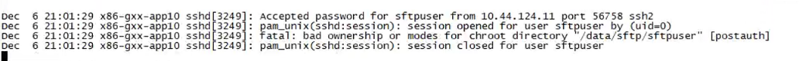

# 参考地址(对我的情况不管用)

[SSH登录到AWS EC2错误: packet_write_wait:连接到x.x端口22:管道断开-腾讯云开发者社区-腾讯云](https://cloud.tencent.com/developer/ask/sof/105593591/answer/103072718)

[解决Linux下ssh登录后出现 报错 Write failed: Broken pipe 的方法 - 白天的影子 - 博客园](https://www.cnblogs.com/x00479/p/11327195.html)

[解决Linux下ssh登录后出现 报错 Write failed: Broken pipe 的方法-阿里云开发者社区](https://developer.aliyun.com/article/713431)

[Linux - SSH - 尝试登录后立即关闭连接 - Unix & Linux Stack Exchange --- linux - SSH - connection is closed immediately after trying to login - Unix & Linux Stack Exchange](https://unix.stackexchange.com/questions/697700/ssh-connection-is-closed-immediately-after-trying-to-login#)

[sshd - 为什么我的 SSH 连接在公钥认证成功后立即关闭？ - Unix & Linux Stack Exchange --- sshd - Why is my SSH connection being closed immediately after pubkey auth succeeds? - Unix & Linux Stack Exchange](https://unix.stackexchange.com/questions/323776/why-is-my-ssh-connection-being-closed-immediately-after-pubkey-auth-succeeds#)