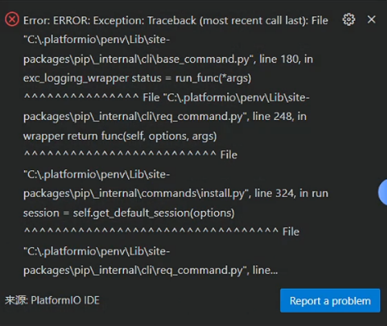
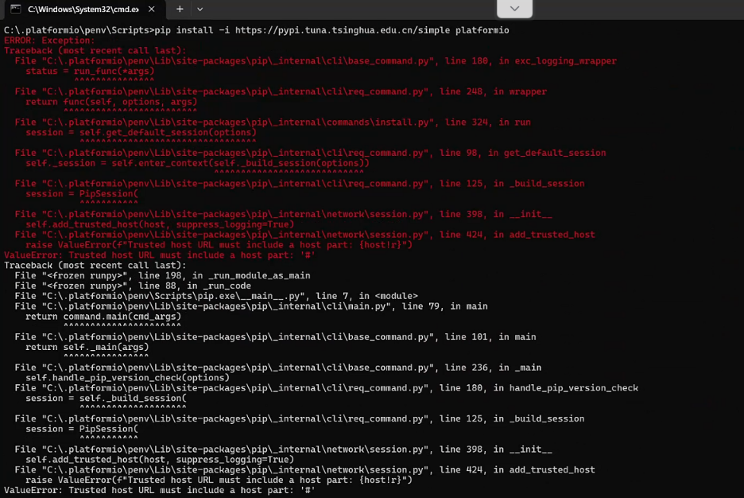
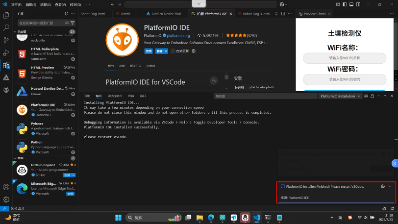
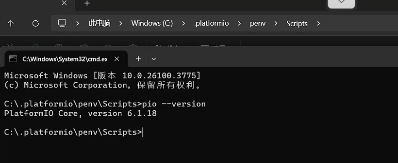
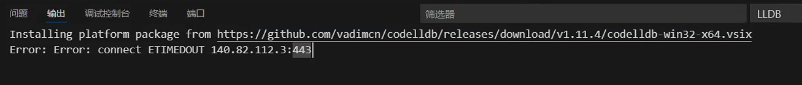
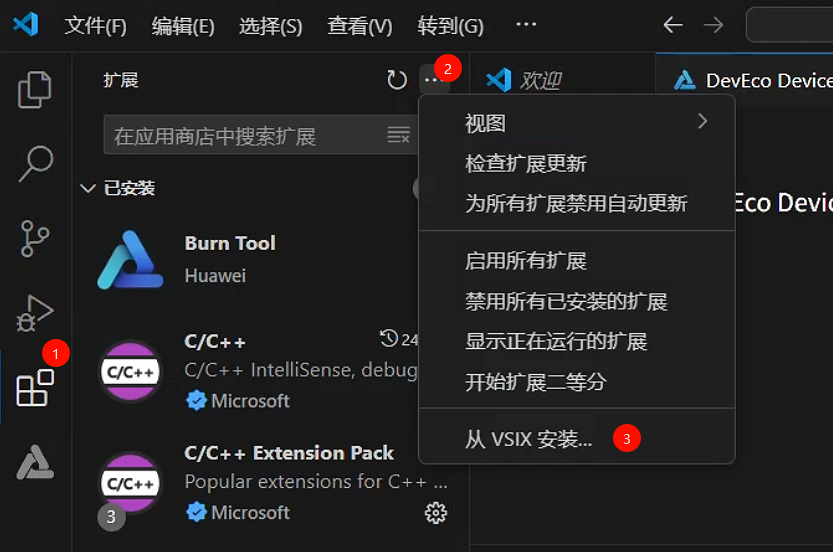
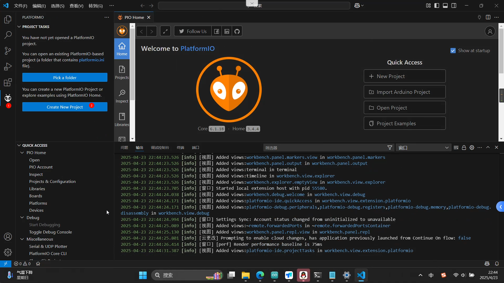

# 系统环境

版本: 1.99.3 (user setup)
提交: 17baf841131aa23349f217ca7c570c76ee87b957
日期: 2025-04-15T23:18:46.076Z
Electron: 34.3.2
ElectronBuildId: 11161073
Chromium: 132.0.6834.210
Node.js: 20.18.3
V8: 13.2.152.41-electron.0
OS: Windows_NT x64 10.0.26100

最好的方法就是：禁用掉目前环境的python环境，以及设置DNS为8.8.8.8，检查%APPDATA%\pip\pip.ini有没有问题

其次：自己下载python环境，然后安装pip install -i https://pypi.tuna.tsinghua.edu.cn/simple --trusted-host pypi.tuna.tsinghua.edu.cn platformio

然后手动创建图标：pio init --ide vscode

 

# 报错日志

从这里可以知道.platformio在C盘下，并没有在用户下，尝试手动安装

在执行 `pip install` 命令时出现了 `ValueError: Trusted host URL must include a host part: '#'` 错误。此错误一般是由于 `pip` 配置文件里存在无效的受信任主机配置所导致的。

打开cmd,输入：%APPDATA%\pip\pip.ini

然后把#后面的删除掉就好了，重新安装。

看起来是安装成功了。把这个文件.platformio迁移到用户下

然后在重新打开vscode，发现在安装另外一个插件的时候失败了，是因为电脑无法访问github的原因，所以手动下载并安装

手动下载完成后安装

