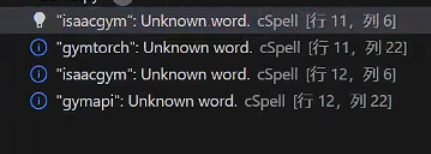
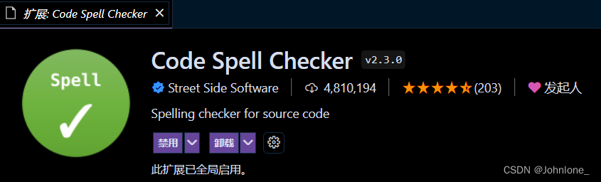

# 问题描述1（解决）

在VScode1.95.3中通过ssh连接了一台Ubuntu20.04的服务器，并且安装了python以及pylance插件，发现使用import os  等等python的代码，发现没有语法高亮。如图：

解决方案：

第一方案：到服务器里面备份.vscode-server（mv .vscode-server .vscode-server.bak）或者是在vscode插件里删除掉所有的插件也可以。然后重新连接，重新下载插件。（推荐）

第二方案：切换vscode的主题

第三方案：打开vscode的设置，搜素Python:Language Server的值修改为Pylance，并搜索semanticHighlighting把值改为true，然后关闭，在重新连接。

# 问题描述2 VScode 通过ssh连接服务器，使用不了ctrl跳转不了函数

问题描述：VScode 通过ssh连接服务器，使用不了ctrl跳转不了函数，但是其他人连接这个服务器是可以的，就是我不行。

原因：可能是服务器的插件版本与本地的版本不同导致的（vscode开启了自动升级，但是插件没有升级）

解决方法：把服务器的所有插件都删掉，本地的也都删掉，重新连接安装即可解决

# 问题描述3 （未解决）服务器问题 pylance

在win11中的vscode版本是1.96.2 通过ssh远程的服务器Ubuntu 20.04.3，语法没有高亮，也没法按住Ctrl跳转函数。通过问题描述1中的方法都试了，不可用。

得出结论：应该是服务器的 Pylance没法运行起来，原因未知。（本地测试的可以的语法高亮和函数跳转）

# 问题描述4

vscode（1.96.4）远程ssh后，在检查python语法的时候，代码出现蓝色的波浪线，并显示"xxxxx":Unknown word.cSpell

得出结论：安装了拼写检查插件（比如*Code Spell Checker）* ，禁用或者卸载即可（果然卸载了Code Spell Checker就解决了）

# 参考：

[vscode pylance取消语法高亮_pylance开启semantic highlighting-CSDN博客](https://blog.csdn.net/onion_rain/article/details/115857414)

[解决vscode代码不高亮显示的问题 - 知乎](https://zhuanlan.zhihu.com/p/655330634)

[（已解决）vscode python 代码高亮异常 - 引入的包不显示 - MoonOut - 博客园](https://www.cnblogs.com/moonout/p/17173711.html)

[VSCode Python代码无高亮 Pylance运行异常_vscode pylance-CSDN博客](https://blog.csdn.net/weixin_47284189/article/details/136343653)

[VS code：代码出现蓝色波浪线，提示显示 xxxx: Unknown word.cSpell-CSDN博客](https://blog.csdn.net/Johnlone_/article/details/123824129)

