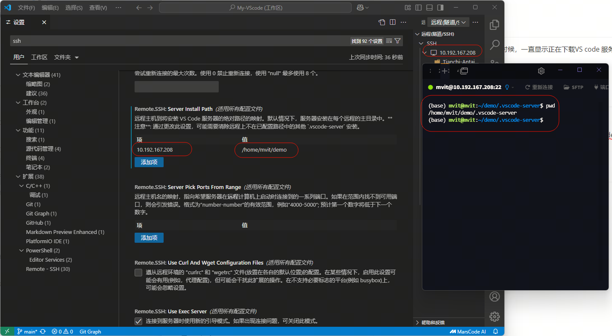
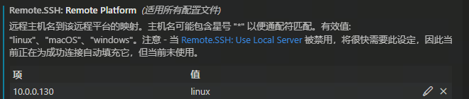
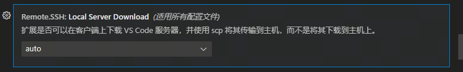

# 问题背景

使用vscode通过ssh连接linux服务器的时候，一直显示正在下载VS code 服务器，一直在重复

# 问题原因

1，是因为磁盘空间满了，导致一直解压不了，或者是下载不了

默认情况下，vscode 服务器是下载到tmp中，然后在解压到家目录的.vscode中

2，也有可能是权限问题

# 解决方法

1，扩容磁盘空间

2，修改正确的权限

3，修改vscode server服务器的安装地址

其他选择

如果出现无法选择主机类型的时候，可以在配置文件中找到这个修改

可以选择在本地下载后通过scp再上传到服务器

