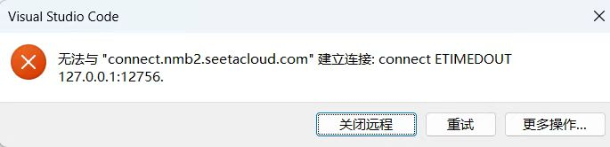

# 背景

vscode远程autodl上的服务器（ubuntu22.04）出现如下报错，以及梯子也使用不了clash等

尝试：

​	更新vscode版本，降级版本     无果

​	关闭防火墙                                 无果

​	检查代理，vpn全是关闭

​	检查浏览器插件代理没有

最终解决方案：

​	重置网络设置

​		重置 TCP/IP 堆栈：netsh int ip reset

​		刷新 DNS 缓存：ipconfig /flushdns

​		重置 Winsock 目录：netsh winsock reset

​		重启电脑：即可成功解决