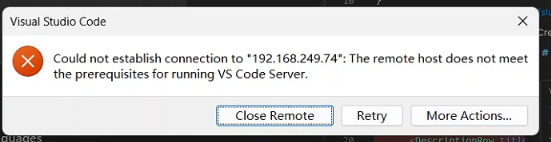
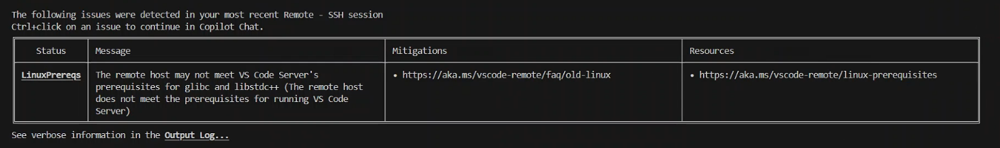
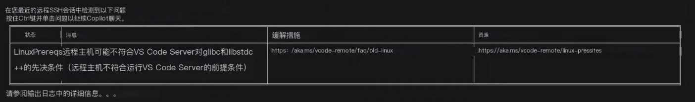
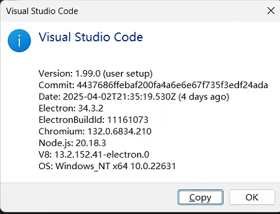

# 前置情况

1.VSCode曾经在1.86表示，将在2025年2月之后不再支持glibc<2.28的服务器，但是还是可以用的，只是有提示而已。


2.VScode 在1.99.x之后，ssh连接的服务器必须要满足：glibc >= 2.28 and libstdc++ >= 3.4.25才可以使用

> [!WARNING]
>
> Starting with VS Code release 1.99 (March 2025), the prebuilt servers distributed by VS Code are only compatible with Linux distributions that are based on glibc 2.28 or later. These include for example, Debian 10, RHEL 8, or Ubuntu 20.04.
>
> **从 VS Code 版本 1.99（2025 年 3 月）开始，VS Code 分发的预构建服务器仅与基于 glibc 2.28 或更高版本的 Linux 发行版兼容。例如，这些包括 Debian 10、RHEL 8 或 Ubuntu 20.04。**


## 报错截图：










# 解决方法

## centos7 

参考该教程升级glibc到2.28，[【VSCode】解决VSCode 1.99以后的远程连接问题：远程主机可能不符合 glibc 和 libstdc++ VSCode 服务器的先决条件_远程主机不满足运行vs code服务器的先决条件-CSDN博客](https://blog.csdn.net/qq_33968692/article/details/146191922)

还有一直技术解决方法：[官网](https://code.visualstudio.com/docs/remote/faq#_can-i-run-vs-code-server-on-older-linux-distributions)

或者是，降级vscode的版本，可以降级到1.99.x之前的，例如：

https://update.code.visualstudio.com/1.98.2/win32-x64/stable

> 关闭自动更新
>
> - Modify settings -> Application -> Update
>
>   Enable Windows Background Updates -> off
>
>   Mode (Configure whether you receive automatic updates) -> none
>
> - Settings -> Feature -> Extensions
>
>   Auto Check Updates -> Off
>
>   Auto Update -> None

删除缓存路径（windows）

插件缓存：C:\Users\[用户名]\.vscode\extensions
用户缓存：C:\Users\[用户名]\AppData\Roaming\Code


CMD命令

```
del C:\Users\%USERNAME%\.vscode
del C:\Users\%USERNAME%\AppData\Roaming\Code
```