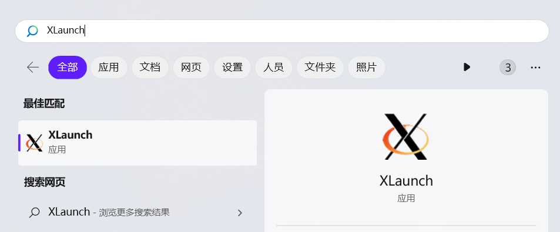

# 背景

通过vscode的ssh连接了一台jetson的ubuntu20.04系统，需要使用x11转发功能。


# windows 教程

## 在客户端上配置

```
Host 192.168.37.114
    HostName 192.168.37.114
    User jetson
    Forwardx11 yes
    Forwardx11Trusted yes
    ForwardAgent yes
```

## 在服务器配置

```
X11Forwarding yes
X11Display0ffset 10
X11UseLocalhost yes
```

PS 注意这样还是不能用的，因为win上是没有x11的客户端的，可能提示：Error: Can't open display: 127.0.0.1:10.0

## 重点（在windows上安装）

### VcXsrv

官网下载：[VcXsrv Windows X Server download | SourceForge.net](https://link.zhihu.com/?target=https%3A//sourceforge.net/projects/vcxsrv/)

安装完会出现`XLaunch`在菜单中，这就是我们需要的所谓`XServer`软件



PS 一定要安装这个，否则在windows上使用不了，除非使用mobaxterm这列集成的也可以


# 参考

[VSCode『SSH』连接服务器『GUI界面』传输 - 知乎](https://zhuanlan.zhihu.com/p/657247771)