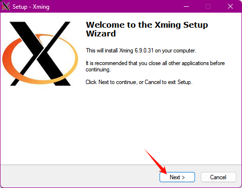
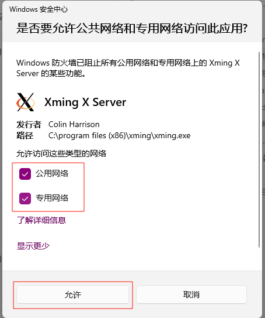

# 背景

通过vscode的ssh连接了一台jetson的ubuntu20.04系统，需要使用x11转发功能。


# windows 教程

## 在客户端上配置

```
Host 192.168.37.114
    HostName 192.168.37.114
    User jetson
    Forwardx11 yes
    Forwardx11Trusted yes
    ForwardAgent yes
```

## 在服务器配置

```
X11Forwarding yes
X11Display0ffset 10
X11UseLocalhost yes
```

PS 注意这样还是不能用的，因为win上是没有x11的客户端的，可能提示：Error: Can't open display: 127.0.0.1:10.0

## 重点 （推荐）

### 下载Xming（推荐，本教程使用xming）

[Xming X Server for Windows 下载 |SourceForge.net --- Xming X Server for Windows download | SourceForge.net](https://sourceforge.net/projects/xming/)


### 下载VcXsrv

官网下载：[VcXsrv Windows X Server download | SourceForge.net](https://link.zhihu.com/?target=https%3A//sourceforge.net/projects/vcxsrv/)

安装完会出现`XLaunch`在菜单中，这就是我们需要的所谓`XServer`软件


PS 一定要安装这个，否则在windows上使用不了，除非使用mobaxterm这列集成的也可以


### 安装步骤




这里选择Full installation 全部安装
其中你可以选择Nomal PuTTY Link SSH clinet（安装一个在本地的PuTTY）
或者是Portable PuTTY Link SSH client - use with Portable PuTTY（安装一个携带式的PuTTY）
我这里不需要，就选择Don't install an SSH client



安装完成后，会有显示这2个图标


### 方法1用法


###### 使用XSHELL连接则需要开启X11转发，如图：


###### 若使用putty连接，则如图：


###### 如使用cmd 则使用如下命令

ssh -XY user@host-server 


进去系统之后配置如下：

**export DISPLAY=本机IP:xming端口 **    #win的ip

```
[root@test33 ~]# export DISPLAY=192.168.168.166:0.0    
```

接下来，在root用户下执行，**xhost +**
若出现access control disabled, clients can connect from any host。
则成功。

```
[root@test33 ~]# xhost +
access control disabled, clients can connect from any host
```

我这打开xming后是0.0。所以设置export为**本机IP:0.0**


设置好后，可以安装个软件试下。
界面可以弹出，成功。


#### 方法2用法（方法1不行就试这个）

需要在Xming的安装目录添加白名单，我的是C:\Program Files (x86)\Xming    【根据自己安装的路径来】

编辑这个X0.hosts


把服务器的ip写进去，例如我的ubuntu的ip是192.168.168.100


然后在服务器中/etc/ssh/sshd_config添加如下：

```
X11Forwarding yes
```

重启ssh 

```
systemctl restart sshd
service ssh restart
```

重复方法1的步骤，配置一遍。即可尝试是否可以

# 参考

[VSCode『SSH』连接服务器『GUI界面』传输 - 知乎](https://zhuanlan.zhihu.com/p/657247771)

[设置 X11 转发以在 Linux 中访问 GUI - 雪竹子 - 博客园](https://www.cnblogs.com/lkj371/p/17625608.html)

[vscode Linux x11 设置 - 简书](https://www.jianshu.com/p/aae11ab8fb33)

[vscode远程连接服务器+X11插件图形化界面_x11 remote access full vscode-CSDN博客](https://blog.csdn.net/Stone_hello/article/details/120041495)


[将Linux 图形界面输出到Windows上 - JaxonYe - 博客园](https://www.cnblogs.com/yechangxin/articles/17288259.html)

[windows下Xming调用linux的图形界面-CSDN博客](https://blog.csdn.net/qq_36293096/article/details/103871875)

