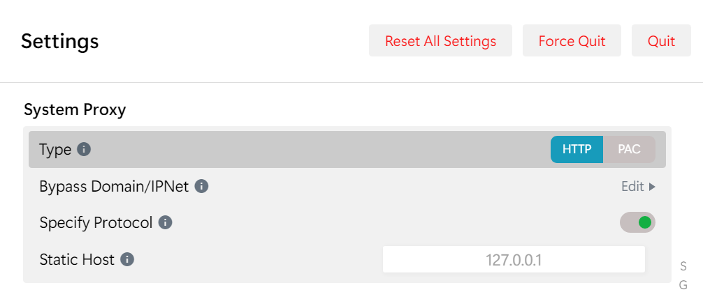
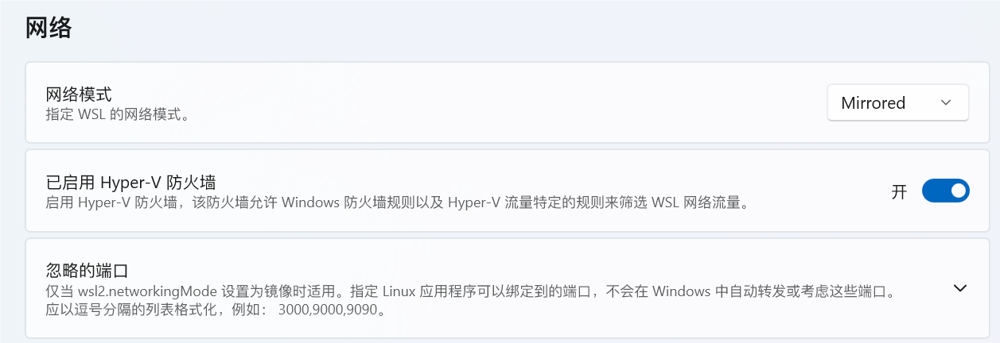

# 代理的配置和测试

## 在 WSL2 中使用 Clash for Windows 代理连接

### 1. 在 Clash 客户端内的操作

打开客户端的 **允许局域网连接 (Allow LAN) 开关**，如图 1 所示。
记录下客户端内的端口 (Port)，如这里是 `16514`. 一般默认端口为 `7890`.


###  2. 配置

#### 方法一

> [!WARNING]
>
> 这个方法需要 Windows 11 22H2 和 WSL 2.0.5 及以上版本，如果你不满足版本要求，请参考[方法二](https://eastmonster.github.io/2022/10/05/clash-config-in-wsl/#方法二)。
> 你可以使用 `winver` 和 `wsl -v` 查看你的 Windows 和 WSL 版本。

> [!WARNING]
>
> 如果你使用这个方法，你需要确保 Clash 客户端中设置的系统代理类型为 HTTP 而不是 PAC，否则无法代理 HTTPS 请求:
> 
> 如果你确实需要使用 PAC 模式，请参考方法二，在 shell 的配置文件中添加:
>
> export https_proxy=$http_proxy


在 WSL [2.0.5 版本](https://github.com/microsoft/WSL/releases/tag/2.0.5)后，一些特性得以稳定，这里要用到的是[镜像模式网络](https://learn.microsoft.com/zh-cn/windows/wsl/networking#mirrored-mode-networking)。

在 `C:\Users\<UserName>\.wslconfig` 文件中 (如果不存在就手动创建一个) 加入以下内容:

```
[wsl2]
networkingMode=mirrored
```

> [!NOTE]
>
> WSL [2.3.11 版本](https://github.com/microsoft/WSL/releases/tag/2.3.11)新增了图形化配置界面 (WSL Settings)，在**网络 > 网络模式**处选择 `Mirrored` 即可：
> [](https://s2.loli.net/2024/07/28/LmNRoCwHscBnYk3.png)

不过需要注意，shell 的配置文件中**不能**再 `export http_proxy=...`.


#### 方法二

WSL [2.2.1 版本](https://github.com/microsoft/WSL/releases/tag/2.2.1)以后默认启用了 DNS 隧道, 会导致**该方法**失效。你可以参照[官方文档](https://learn.microsoft.com/zh-cn/windows/wsl/wsl-config#wslconfig)配置，在 `C:\Users\<UserName>\.wslconfig` 文件中 (如果不存在就手动创建一个) 加入以下内容以关闭 DNS 隧道:

```
[wsl2]
dnsTunneling=false
```

你可以执行 `wsl -v` 查看你的 WSL 版本。

> [!NOTE]
>
> 这里默认你使用 bash, 如果你使用其他的 shell, 我相信你知道该改哪里。


编辑 `.bashrc`，在文件末尾根据第 1 步记录的数据，加入三行内容：

```
host_ip=$(cat /etc/resolv.conf |grep "nameserver" |cut -f 2 -d " ")
export http_proxy="http://$host_ip:[端口]"
export https_proxy="http://$host_ip:[端口]"
exprot ALL_PROXY="http://$host_ip:[端口]"

或者是：
proxy-server=127.0.0.1
port=7890
export http_proxy=http://proxy-server:port
export https_proxy=http://proxy-server:port
export ftp_proxy=http://proxy-server:port
export ALL_PROXY=http://proxy-server:port
```

如图 2 所示，修改完后保存即可。
[](https://s2.loli.net/2022/10/05/qWgwrFU7OMupiH2.png)														图 2

输入 `source ~/.bashrc` 使文件修改生效，可以通过输入 `echo $http_proxy` 验证修改是否成功。

### 取消代理

```
unset http_proxy https_proxy ftp_proxy ALL_PROXY
```


## Windows的CMD走代理
```
set http_proxy=http://127.0.0.1:10809 
set https_proxy=http://127.0.0.1:10809
```

若要长久生效，在系统环境变量中添加：

http_proxy 和 https_proxy 两个系统变量，值均为：[http://127.0.0.1:10809](http://127.0.0.1:10809/)

### CMD取消代理

```bash
set http_proxy=
set https_proxy=
```


## Git走代理

```bash
git config --global http.proxy http://127.0.0.1:7890
git config --global https.proxy http://127.0.0.1:7890
```

### Git取消代理

```bash
git config --global --unset http.proxy
git config --global --unset https.proxy
```


## python走代理

```
import os

# 设置代理环境变量
os.environ["http_proxy"] = "http://127.0.0.1:7890"
os.environ["https_proxy"] = "http://127.0.0.1:7890"
os.environ["ALL_PROXY"] = "http://127.0.0.1:7890"
```


## 测试代理是否通

方法一

```
curl ip.sb  
13.251.172.174    

curl 4.ipw.cn
13.251.172.174

curl myip.ipip.net
当前 IP：218.19.46.219  来自于：中国 广东 广州  电信

curl ipinfo.io
{
  "ip": "13.251.172.174",
  "hostname": "ec2-13-251-172-174.ap-southeast-1.compute.amazonaws.com",
  "city": "Singapore",
  "region": "Singapore",
  "country": "SG",
  "loc": "1.2897,103.8501",
  "org": "AS16509 Amazon.com, Inc.",
  "postal": "018989",
  "timezone": "Asia/Singapore",
  "readme": "https://ipinfo.io/missingauth"
}


curl google.com -vvv
curl www.google.com -vvv
curl www.google.com.hk -vvv
```

返回 IP 如果是代理服务器 IP 说明当前终端下已经走代理了。

- 测试终端环境下是否走了代理，使用 `ping google.com` 是可能不行的，因为 ping 命令既不是 HTTP 也不是 HTTPS 协议，而是 ICMP 协议，始终是不走代理的，如果要 ping 也走代理，那么需要一些比较高级的方法，比如配置透明代理之类的，本文就不涉及了。


方法二   (推荐)

wget google.com

wget www.google.com

wget www.google.com.hk


参考：

[在 WSL2 中使用 Clash for Windows 代理连接 - East Monster 个人博客](https://eastmonster.github.io/2022/10/05/clash-config-in-wsl/)

[终端设置代理 – Clloz ☘️](https://www.clloz.com/programming/assorted/2020/09/15/terminal-proxy-configure/)