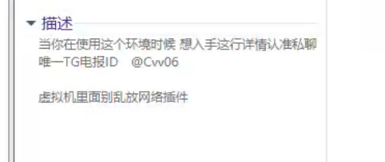

# PE 

看起来挺吊的这个PE，功能强大，自带联网模块

链接：[光盘镜像丨WindowsPE-X64&X86 - Angel_天使WinPE](https://www.angel-pe.cn/guang-pan-jing-xiang-gun-windowspex64-x86/)

下载链接：[PE - Y盘](https://pan.yyej.com/s/bmSa?path=%2F)

为什么用了，VMware虚拟机中的win10忘记密码了(使用了UEFI引导) 

我使用UEFI好像不行，我就切换了引导方式，就可以识别啦。

