## 首要条件

1.有个U盘的PE系统

2.对需要扩容的电脑进行解锁BitLocker

​	2.1以管理员打开cmd，输入manage-bde -status，如果加密了会显示已加密百分比，否则无

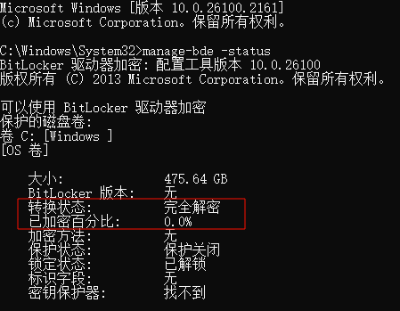

​		2.2解除加密命令：manage-bde -off C:

## 实际操作步骤

进入PE系统，根据自己的电脑型号切换启动顺序即可：（公司电脑）

​	联想、华为开机按F12

​	惠普开机按F9

​	SMI微星主板按F11

以下使用联想笔记本演示的演示

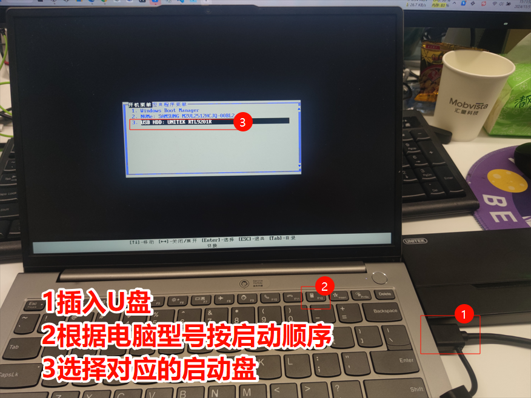

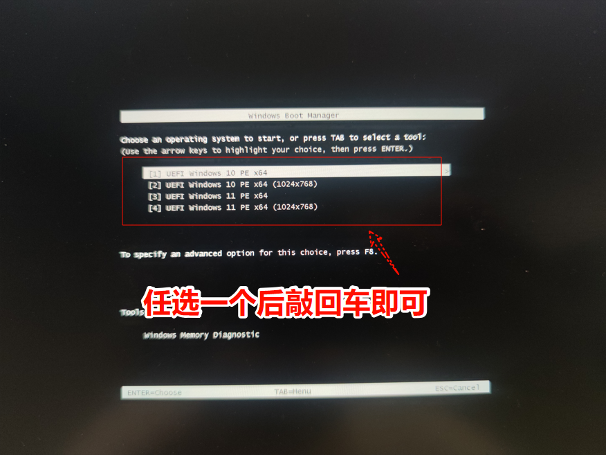

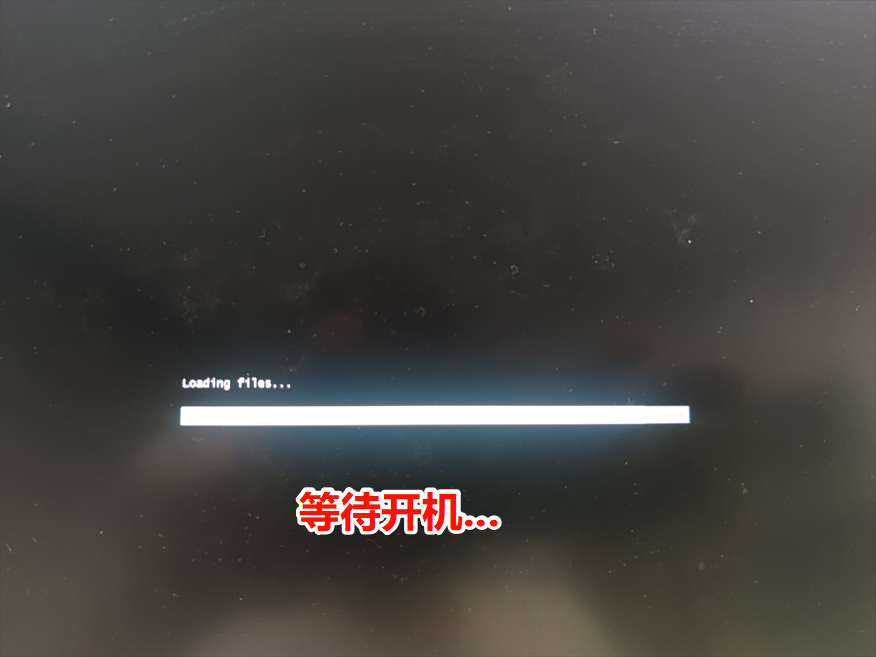

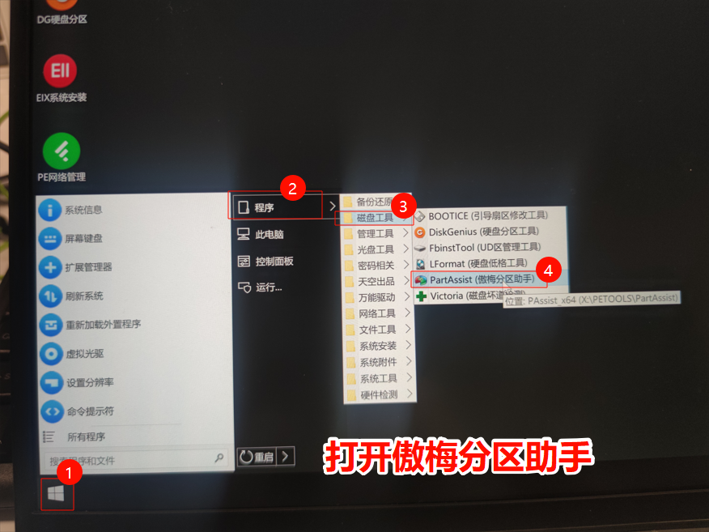

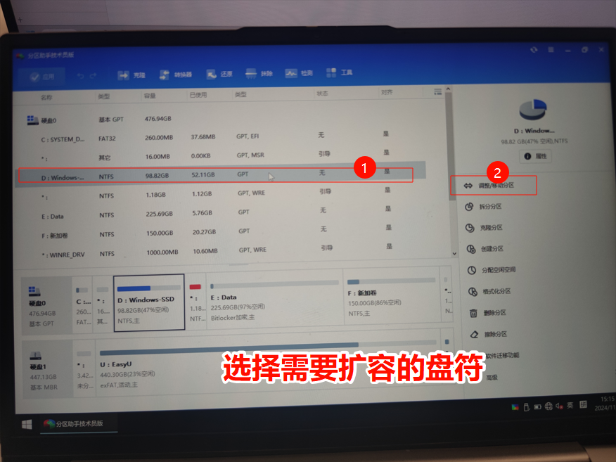

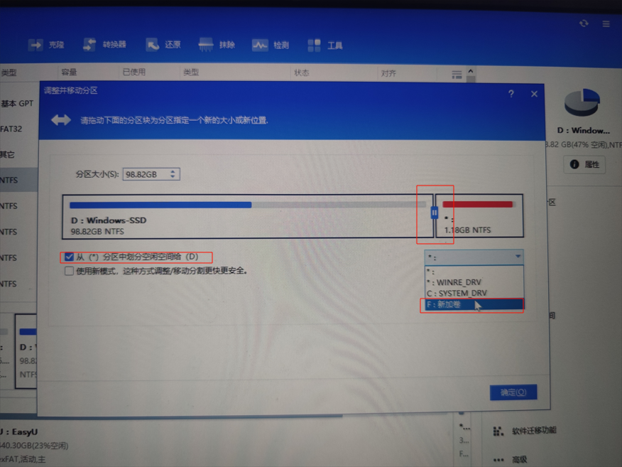

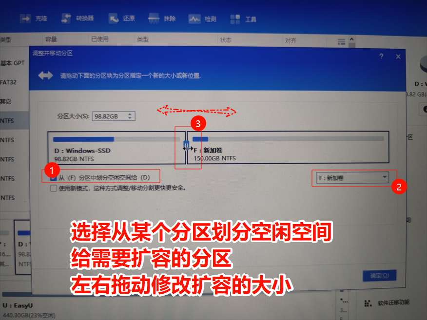

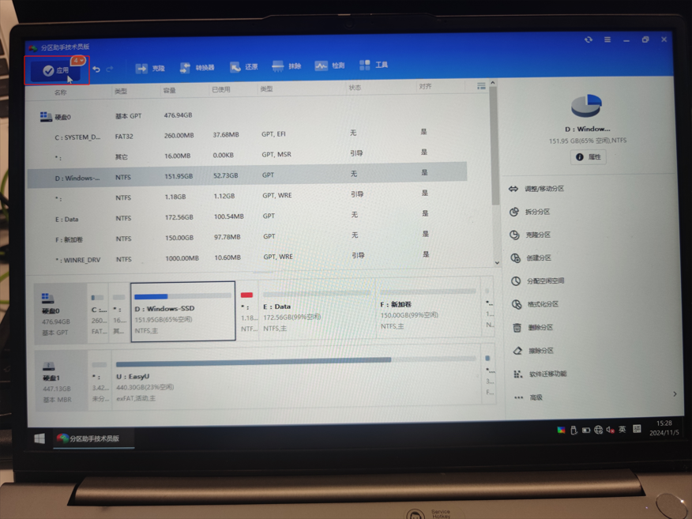

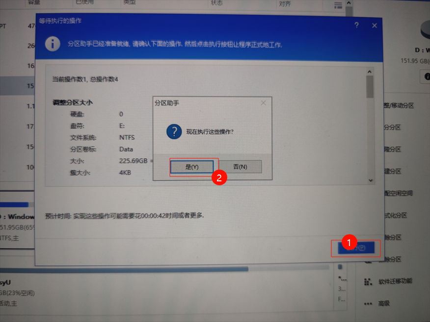

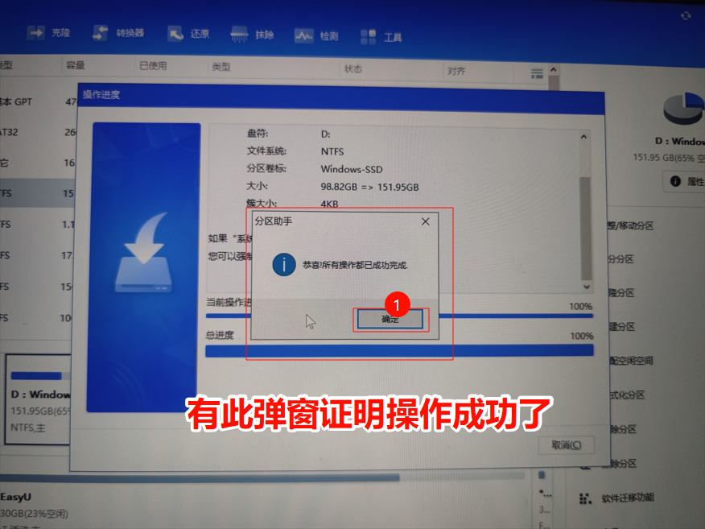