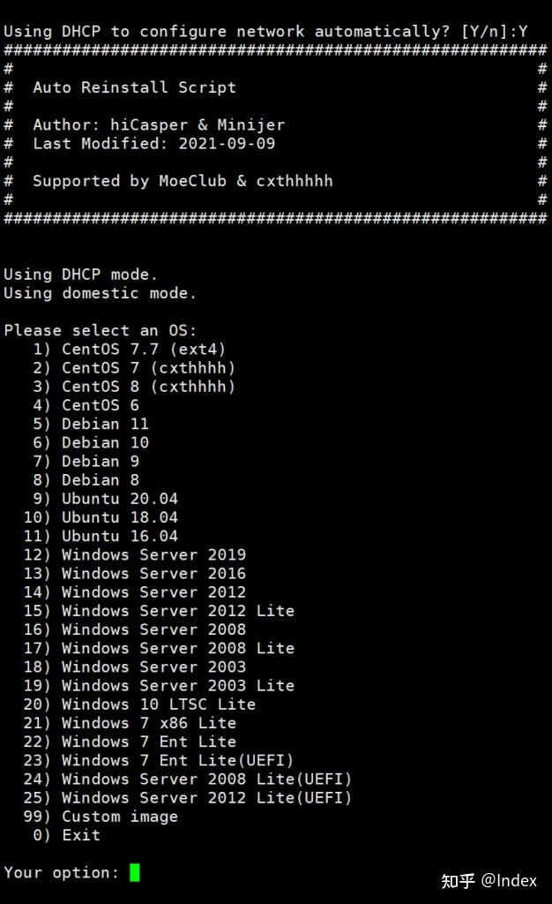

# 介绍


基本上所有的主机提供商都会提供免费的Linux系统以供安装使用，如CentOS、Debian、Ubuntu等。那为什么我们还要使用一键DD脚本重装/更换系统呢？

1. 商家提供的系统版本有限，可能没有自己需要的版本；
2. Windows系统通过正规渠道安装需要收费
3. 商家提供的系统大多都是改装过的，不纯净，可能存在软件兼容行问题；
4. 商家提供的系统大多带有监控，特别是某里云，某鹅云，卸载监控和排查后门不是那么简单的。

### 警告：重装系统将抹掉所有数据，并可能导致服务器无法开机！所以请确保服务器上所有文件和数据库都已备份完成！请谨慎操作！

## 一键重装纯净的系统

使用脚本前请执行以下命令确保必须的软件已经安装

```text
# CentOS 与 RedHat
yum install -y xz openssl gawk file wget

# Debian 与 Ubuntu
apt-get install -y xz-utils openssl gawk file
```

### 下载并执行安装脚本

```text
#要挂代理(建议用这个脚本DD，答主用这个成功过，下面的那个不好说)
wget --no-check-certificate -qO AutoReinstall.sh 'http://git.io/AutoReinstall.sh' && bash AutoReinstall.sh
#国内可用
wget --no-check-certificate -O AutoReinstall.sh https://d.02es.com/AutoReinstall.sh && chmod a+x AutoReinstall.sh && bash AutoReinstall.sh
```

输入Y确认DD重装后自动获取IP，如果有特殊的设置则可输入N自行配置IP

设定完IP后，选择自己想要的操作系统



选择系统后即可等待服务器重新上线了，等待时间应该在半小时到一小时，密码记不记都没关系，下面有密码总结

还有超过2小时还没上线的话一般就是寄了，到控制台重开吧


安装好后，例如是win系统，则桌面远程3389端口即可远程过去，还有就是记得到安全组中开放对应的端口。


## 25个系统的默认密码：


1、CentOS 7.7 (已关闭防火墙及SELinux，默认密码Pwd@CentOS)
2、CentOS 7 (默认密码[http://cxthhhhh.com](https://link.zhihu.com/?target=http%3A//cxthhhhh.com))
3、CentOS 8 (默认密码[http://cxthhhhh.com](https://link.zhihu.com/?target=http%3A//cxthhhhh.com))
4、CentOS 6 (默认密码[http://Minijer.com](https://link.zhihu.com/?target=http%3A//Minijer.com))
5、Debian 11 (默认密码[http://Minijer.com](https://link.zhihu.com/?target=http%3A//Minijer.com))
6、Debian 10 (默认密码[http://Minijer.com](https://link.zhihu.com/?target=http%3A//Minijer.com))
7、Debian 9 (默认密码[http://Minijer.com](https://link.zhihu.com/?target=http%3A//Minijer.com))
8、Debian 8 (默认密码[http://Minijer.com](https://link.zhihu.com/?target=http%3A//Minijer.com))
9、Ubuntu 20.04 (默认密码[http://Minijer.com](https://link.zhihu.com/?target=http%3A//Minijer.com))
10、Ubuntu 18.04 (默认密码[http://Minijer.com](https://link.zhihu.com/?target=http%3A//Minijer.com))
11、Ubuntu 16.04 (默认密码[http://Minijer.com](https://link.zhihu.com/?target=http%3A//Minijer.com))
12、Windows Server 2019 (默认密码[http://cxthhhhh.com](https://link.zhihu.com/?target=http%3A//cxthhhhh.com))
13、Windows Server 2016 (默认密码[http://cxthhhhh.com](https://link.zhihu.com/?target=http%3A//cxthhhhh.com))
14、Windows Server 2012 (默认密码[http://cxthhhhh.com](https://link.zhihu.com/?target=http%3A//cxthhhhh.com))
15、Windows Server 2012 Lite (默认密码nat.ee)
16、Windows Server 2008 (默认密码[http://cxthhhhh.com](https://link.zhihu.com/?target=http%3A//cxthhhhh.com))
17、Windows Server 2008 Lite (默认密码nat.ee)
18、Windows Server 2003 (默认密码[http://cxthhhhh.com](https://link.zhihu.com/?target=http%3A//cxthhhhh.com))
19、Windows Server 2003 Lite (默认密码WinSrv2003x86-Chinese)
20、Windows 10 LTSC Lite (默认密码www.nat.ee)
21、Windows 7 x86 Lite (默认密码Windows7x86-Chinese)
22、Windows 7 Ent Lite (默认密码nat.ee)
23、Windows 7 Ent Lite (UEFI支持甲骨文)(默认密码nat.ee)
24、Windows Server 2008 Lite (UEFI支持甲骨文)(默认密码nat.ee)
25、Windows Server 2012 Lite (UEFI支持甲骨文)(默认密码nat.ee)
99、自定义镜像

另外，欢迎知友们来光临我的小破站，这个是我搭的博客的链接

[Linux一键DD系统安装纯净版CentOS,Debian,Ubuntu,Windows等](https://link.zhihu.com/?target=https%3A//hash070.top/reinstall-pured-linux-windows.html)


参考地址：

[Linux服务器一键DD系统安装纯净版CentOS,Debian,Ubuntu,Windows等 - 知乎](https://zhuanlan.zhihu.com/p/464693328)

[超简单3步用腾讯云VPS搭建远程桌面DD window系统 ， 跨境电商非常好用！_哔哩哔哩_bilibili](https://www.bilibili.com/video/BV11u4y1b72W/?spm_id_from=333.1387.homepage.video_card.click&vd_source=ef4b69a1c844f5523af37fbdcd97d5c5)