# 背景

我使用了vscode来编辑C/C++的代码，我自己自定义了一些头文件，我需要我的代码中引用这些头文件（模块化编程）

 

# 基础了解

### 核心配置文件说明

1. `launch.json`
   - **作用**：定义调试配置参数，如调试器类型、可执行文件路径、命令行参数等
   - 典型场景：
     - 设置调试器（如 GDB 用于 C/C++，Python 解释器用于 Python）。
     - 指定程序入口文件（如 `"program": "${fileDirname}/main.exe"` ）。
     - 关联编译任务（通过 `"preLaunchTask": "build"` 调用 `tasks.json` 中的任务）。
   - **工作区要求**：通常需在工作区 `.vscode` 目录下配置，优先级高于全局用户设置
2. `tasks.json`
   - **作用**：定义自动化任务（如编译、代码检查等），通过命令行工具（如 GCC、Python）执行
   - 典型场景：
     - 编译 C/C++ 项目（如 `gcc -I include/ main.c -o main.exe` ）。
     - 批量处理文件（如使用通配符 `*.c` 编译所有源文件）。
   - **与 `launch.json` 联动**：通过 `preLaunchTask` 字段调用任务，实现“调试前自动编译”。
3. `c_cpp_properties.json`
   - **作用**：配置 C/C++ 扩展的 IntelliSense 行为，如头文件路径、编译器路径等。
   - 核心字段：
     - `includePath`：指定头文件搜索路径（需与 `tasks.json` 的 `-I` 参数匹配）。
     - `compilerPath`：设置默认编译器路径（如 `C:/MinGW/bin/gcc.exe` ）。
   - **工作区要求**：工作区内的配置会覆盖全局设置，建议项目级配置。


## 第一种方法(使用绝对路径或相对路径)

### 头文件包含路径

在项目中，使用第三方库，将第三库的相关文件放入文件夹中


如果不进行必要的配置，在`#include`第三方头文件时，**必须输入路径（绝对路径或相对路径）**

例如：demo.c 

```c
#include "iostream"
#include "./boost/any.hpp"     #必须输入路径（绝对路径或相对路径）
int main()
{
	return 0;
}
```

例如：这里说找不到S_Sequence_List.h

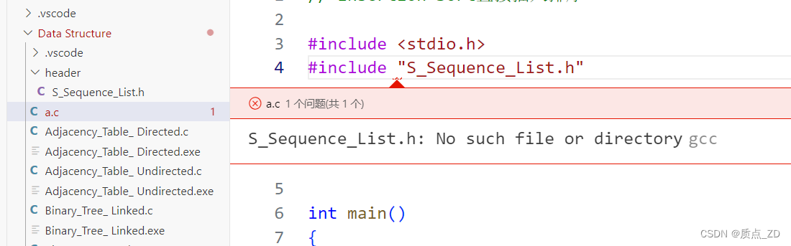

报错解决：

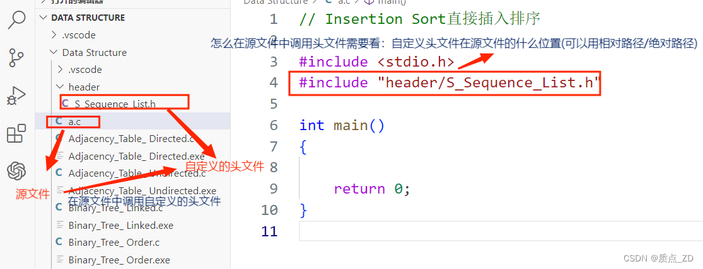

这里的S_Sequence_List.h（自定义的头文件）的上一级文件是header，而header和a.c(源文件)是属于同一级别。这时可以说：S_Sequence_List.h（自定义头文件）在a.c(源文件)同级别的文件header下。相对路径就可以写成：#include "header/S_Sequence_List.h"


如果我们配置了头文件包含路径，则我们可以直接`#include "any.hpp"`

```
#include "iostream"
#include "any.hpp"
int main()
{
	return 0;
}
```

## 方法二（使用同一级目录）（不推荐）

首先我先写一下我的头文件sum.h，源文件sum.cpp，和执行文件coco.cpp

就是全部放在用一个文件夹，这是最无脑的方式，所以这种方式如果遇到大工程的开发时，就会显得很乱，而且也不方便修改。

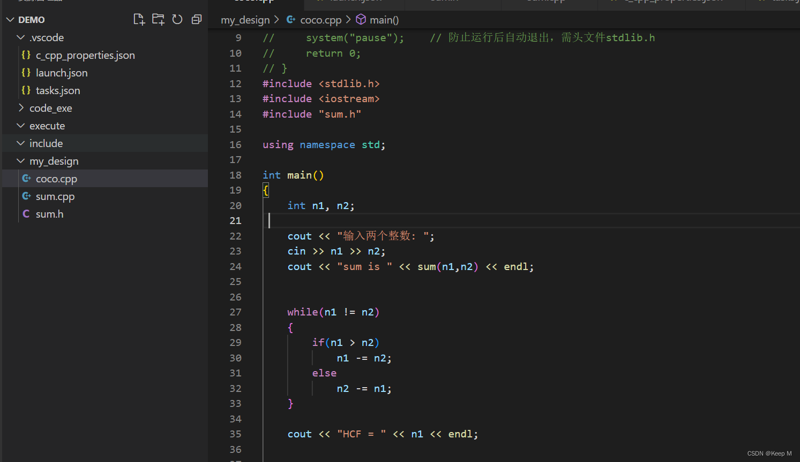

## 方法三（使用工作区）1

#### 配置头文件包含路径步骤（使用工作区）

##### 生成c_cpp_properties.json

点击vscode右下角的Win32

##### 


选择 `C/C++:编辑配置(UI)` 或者是JSON都可以

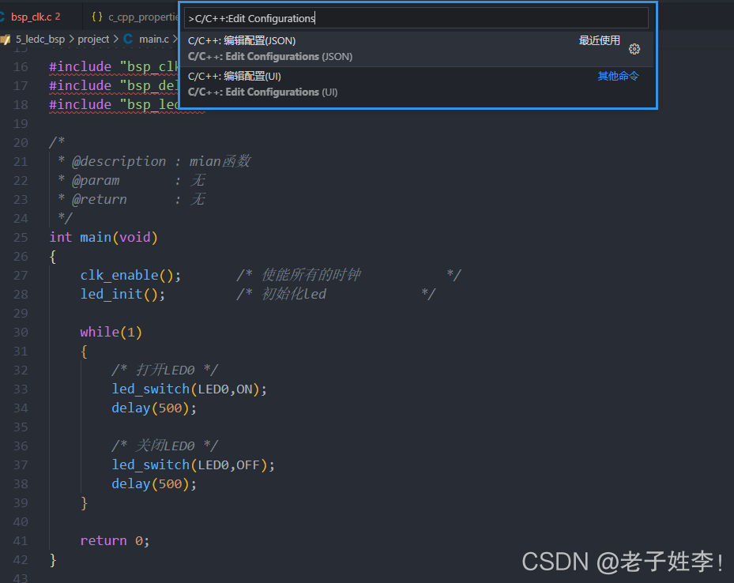


`.vscode`目录下面会自动添加了一个`c_cpp_properties.json`。在`c_cpp_properties.json`中加入自己需要的头文件路径。如图。

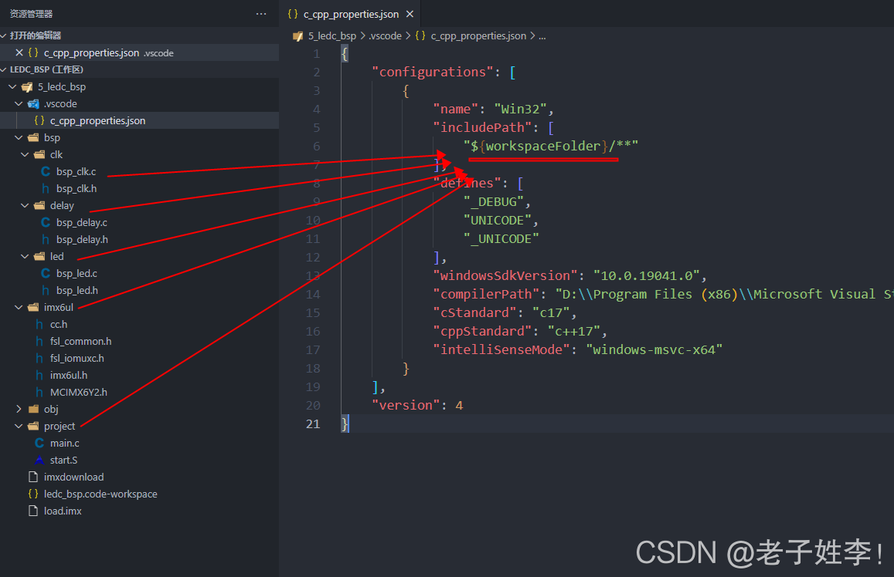

添加完成后如图。

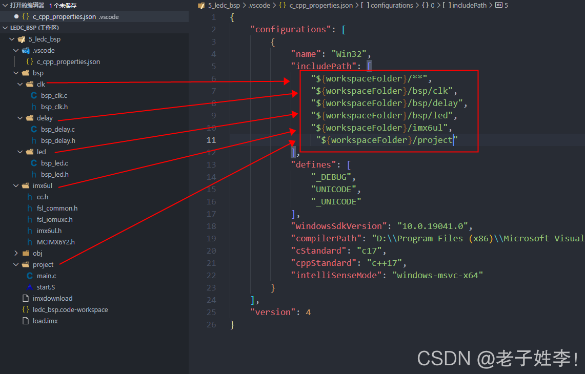

保存`c_cpp_properties.json`即可大功告成。

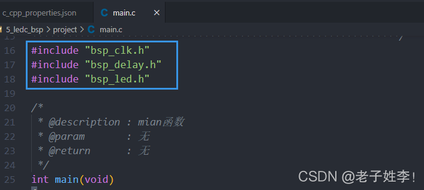

### 注意

**1.`.vscode`文件夹要放置在工作区的根目录
2.注意路径添加的格式。以逗号隔开，最后一行可以不用逗号。**

**3.注意将工作区保存的文件`ledc_bsp.code-workspace`和`.vscode`在同一级目录。**（必须）

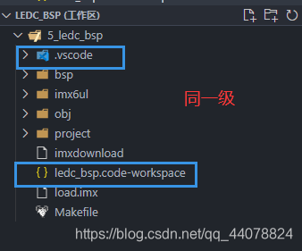

4.建议包含的路径使用相对路径。(不会相对路径，写绝对路径也行)

PS：${workspaceFolder}为当前工作区的路径，以${workspaceFolder}开头的路径就是相对工作区的路径。因为使用绝对路径时，当工作区的路径改变（比如从d盘移到e盘），又会陷入找不到头文件的窘境。


## 方法三 2

先新建三个文件夹，分别是include（存放头文件），execute（存放源文件），code_exe(程序执行的小窗口，后续会将如何修改他保存的路径。)

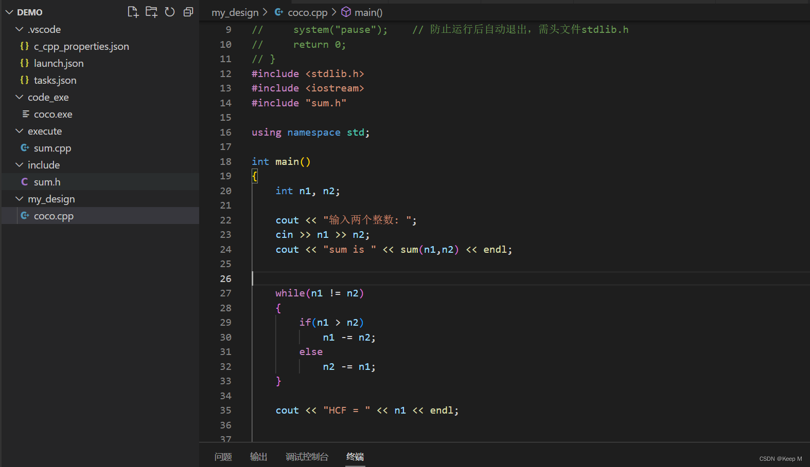

（2）按下ctrl + shift + p ，选择第二个编辑配置，然后会生成一个c_cpp_properties.json文件

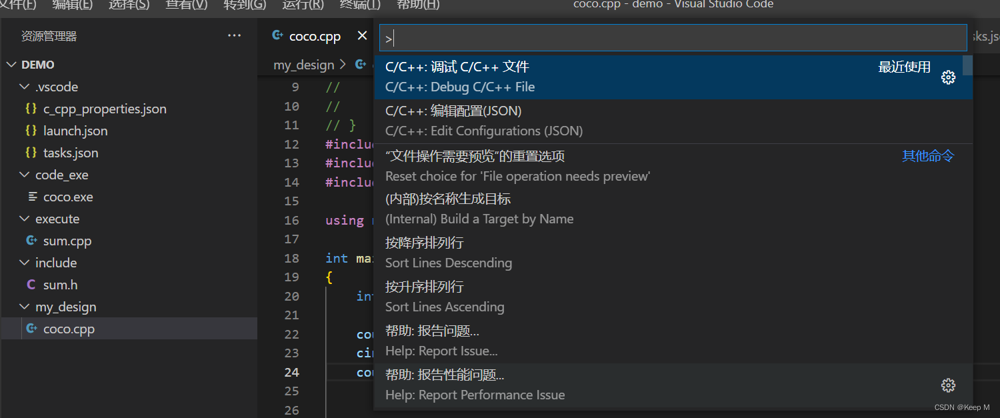

（3）在c_cpp_properties.json文件下的includePath添加头文件的目录，
可以右键include包，然后复制路径。

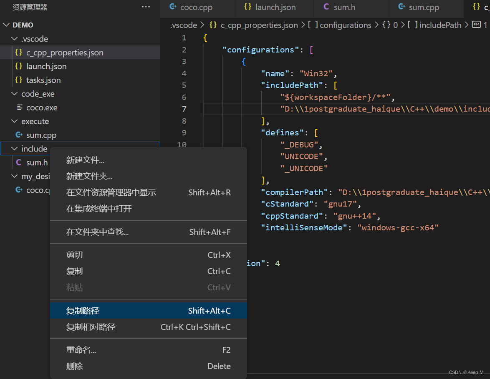

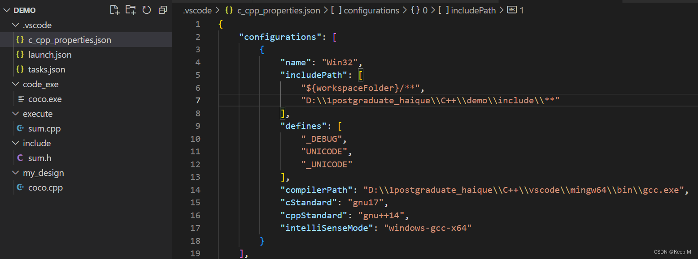

（4）c_cpp_properties.json文件配置完之后，打开task.json文件，这里也需要添加路径，在args的参数里添加“-I”，“头文件的路径”，“源文件的路径”。

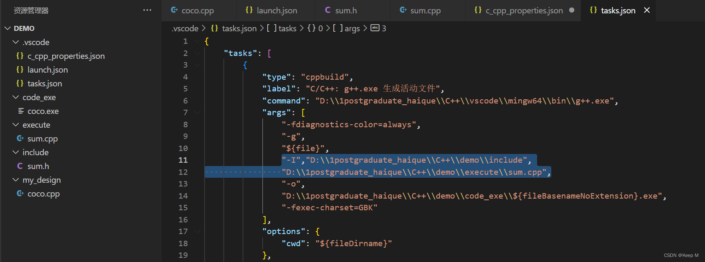

记得保存，保存完之后基本就已经完成了自定义头文件的配置了，然后重启程序你就会发现程序已经可以正常运行了，这里主要就是看c_cpp_properties.json文件和task.json文件，然后把头文件的路径和源文件的路径设置好就行了。


其他扩张（可选）

能够正常使用自定义的头文件之后，我们对执行文件exe也进行一下整理，使他统一保存在一个包了。

我们首先打开.vscode 文件夹下的 task.json 文件，找到 “${fileDirname}\${fileBasenameNoExtension}.exe”

修改成 “${fileDirname}\code_exe\${fileBasenameNoExtension}.exe” 并保存，同理，launch.json 下也有相同的字段，需要你修改

在源文件同目录下新建code_exe 文件夹，程序运行后，可执行文件将会生成在里面（其中 code_exe 可修改成你喜欢的英文名字）

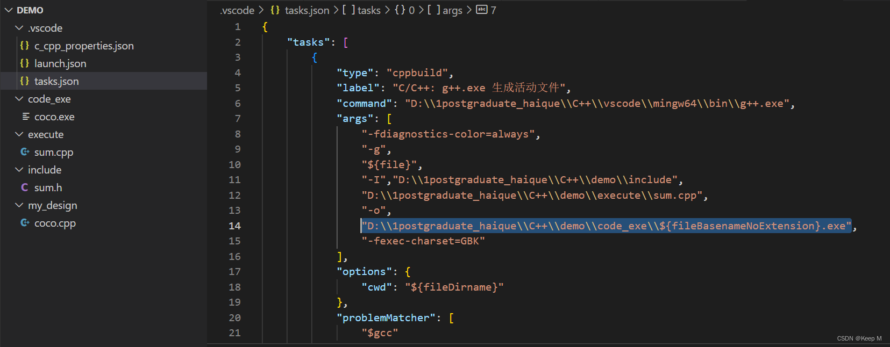

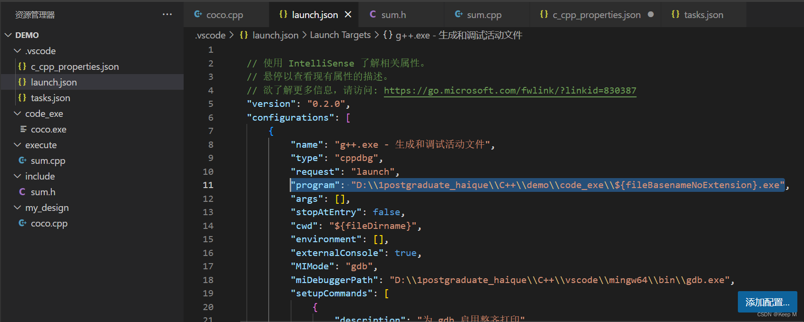

# 参考

[关于VSCode配置C++项目环境——包含头文件路径_vscode设置头文件的包含路径-CSDN博客](https://blog.csdn.net/m0_64240990/article/details/142817057)

[VsCode配置自定义头文件—C语言版_code的头文件库在那里-CSDN博客](https://blog.csdn.net/m0_71494851/article/details/134719685)

[适合初学者！超详细的vscode的C++自定义头文件的配置！_vscode中c++无法正确导入自定义头文件-CSDN博客](https://blog.csdn.net/Lee_zj123/article/details/126868863)